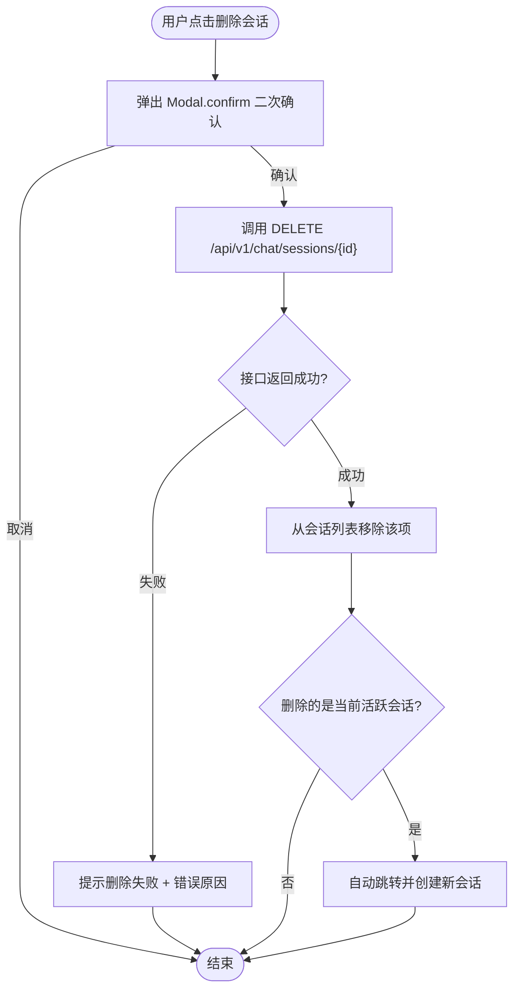

## 变更记录
| 日期 | 说明 | 修订人 |
| --- | --- | --- |
| 7.30 | 初版 | 罗智涵,丁荣辉,何常富,王亚宁 |
| 7.31 | 添加了全局设计,将认证拆分成用户认证和管理员认证,完善1.2业务价值 / 定位 / 目标 | 罗智涵 |
| 7.31 | 添加管理端示意图 | 何常富 |
| 7.31 | 添加用户端示例图 | 王亚宁 |
| 8.3 | 将用户端管理员端层级设为h3在详细设计h2下 | 罗智涵 |


## 1. 需求背景
传统的电影购票 APP 流程繁琐：搜电影 → 选影院 → 挑场次 → 看座位图 → 下单。⽤户需要在多个页面间跳转，反复筛选。 而在⼤模型时代，用户更习惯⼀句话表达需求。 

1. **购票流程繁琐**：传统购票需要用户在多个页面间手动跳转、反复筛选，体验割裂。妙语购票通过自然语言对话 + 动态卡片，将多步操作收敛为一次对话交互。
2. **模糊意图难以表达**：用户心中想"周末看个轻松的喜剧"，但传统搜索只能按片名精确查找。妙语购票的 Agent 能理解模糊意图，主动推荐匹配的影片和场次。
3. **信息缺失需要来回补全**：传统流程中用户经常走到选座才发现场次不合适，需要回退重来。Agent 能在对话开始时识别缺失信息并主动追问，避免无效操作。
4. **信息溢出时步骤冗余**：用户一次性说清所有条件后，传统流程仍要求逐步确认。Agent 的自动跳步逻辑能识别信息完备度，直接跳到选座或出票环节。
5. **异常场景缺乏温度**：场次售罄、座位被抢时，传统系统只报"失败"。Agent 能给出有温度的备选方案（如推荐相邻座位或下一场次）。

### 1.1 需求地址：[PRD-妙语购票](https://www.yuque.com/yuqueyonghuznugvo/zif8xc/gg90g524za4zha5g)
### 1.2 业务价值 / 定位 / 目标
<font style="color:rgb(29, 29, 31);">本项目旨在构建以“AI对话式购票”为核心创新的跨端智能票务平台，通过打造高复用的基础设施底座，全面打通后台数据管理、用户认证、实时消息与核心交易链路，实现从智能交互、安全交易到运营决策的完整业务闭环。</font>

---

## 2. 项目人员
| 角色 | 接口人 |
| --- | --- |
| 前端 | 罗智涵,王亚宁 |
| 后端 | 罗智涵,丁荣辉,何常富,王亚宁 |
| 测试 | 罗智涵,丁荣辉,何常富,王亚宁 |
| agent | 丁荣辉,何常富 |


---

## 3. 项目文档
+ **后端系分**：[后端系分文档](https://www.yuque.com/yuqueyonghuznugvo/zif8xc/kwlkmg0td6g0w1yc)
+ **交互视觉**：

| 页面 | 视觉稿 |
| --- | --- |
| 移动端首页 | <!-- 这是一张图片，ocr 内容为： -->
 |
| 移动端agent | <!-- 这是一张图片，ocr 内容为： -->
 |
| 管理员首页 | <!-- 这是一张图片，ocr 内容为： -->
 |


### 技术选型
| **前端框架** | React + Vite | 19 |  |
| --- | --- | --- | --- |
| **移动端 UI** | Ant Design Mobile | — | 对话界面 + 卡片组件 |
| **PC 端 UI** | Ant Design | — | 管理后台 |
| **座位图渲染(可选)** | Canvas | — | 性能优先，支持数百座位 |
| **响应式布局** | CSS 响应式 | — | web 端自适应 |


---

## 4. 项目排期 / 上线计划
工作安排见:[功能点分工](https://www.yuque.com/yuqueyonghuznugvo/zif8xc/iufpgvdp1q29xdlk)

| 节点 | 日期 |
| --- | --- |
| 全链路联调 | 8 月 4 日 |
| 交付测试 | 8 月 5 日 |
| 预发验收 | 8 月 6 日 |


---

## 5. 详细设计（核心）
### 5.1 全局设计
#### 请求层统一设计
基于 axios 封装全局请求实例，所有模块统一消费。

#####  请求拦截器链
| 序号 | 拦截器 | 逻辑 |
| --- | --- | --- |
| 1 | authInterceptor | 从 localStorage 读 token 注入 `Authorization: Bearer {token}` |
| 2 | idempotentInterceptor | 资金类 POST/PUT（锁座/支付/取消/退票）生成幂等 key（UUID）→ `X-Request-Id` header |


```typescript
  // 1. 注入 Token
  const token = localStorage.getItem('token');
  if (token) config.headers.Authorization = `Bearer ${token}`;

  // 2. 注入 X-Request-Id
  if (idempotentMethods.includes(config.method || '') && idempotentUrls.some(u => config.url?.includes(u))) {
    config.headers['X-Request-Id'] = crypto.randomUUID();
  }

```

##### 响应拦截器链
| 序号 | 拦截器 | 逻辑 |
| --- | --- | --- |
| 1 | businessCodeParser | 解构 `{code, message, data}`；`code !== 0` 走错误映射 |
| 2 | authInterceptor | 401 → 清除 localStorage Token → 跳转登录页 |
| 3 | errorMappingInterceptor | HTTP 状态码 → 处理策略映射(见业务错误码) |


```typescript
(response) => {
  成功
  },
  (error) => {
    失败
  }
```

#### 前端工程结构
```plain
apps/mobile/                          # 移动端工程（React 19 + Vite + antd-mobile）
├── src/
│   ├── layouts/
│   │   └── BasicLayout.tsx           # 全局布局：顶部 NavBar + 底部输入区
│   ├── pages/
│   │   ├── chat/                     # 对话首页（消息流 + 卡片 + 输入）
│   │   │   └── index.tsx
│   │   ├── auth/                     # 用户认证（登录/注册）
│   │   │   ├── login.tsx
│   │   │   └── register.tsx
│   │   ├── notifications/            # 消息通知列表
│   │   │   └── index.tsx
│   │   ├── orders/                    # 订单详情
│   │   │   └── [id].tsx
│   │   └── profile/                  # 个人中心
│   │       └── index.tsx
│   ├── components/
│   │   ├── cards/                    # AI 卡片组件目录（CardRegistry 映射 cardType → Component）
│   │   │   ├── MovieListCard.tsx
│   │   │   ├── CinemaListCard.tsx
│   │   │   ├── SessionListCard.tsx
│   │   │   ├── SeatMapCard.tsx
│   │   │   ├── OrderConfirmCard.tsx
│   │   │   ├── OrderSuccessCard.tsx
│   │   │   ├── RecommendTipCard.tsx
│   │   │   ├── PendingOrderCard.tsx
│   │   │   └── FallbackCard.tsx      # 降级卡片（未注册 cardType）
│   │   ├── OrderCountdown/           # 订单倒计时组件（全局复用）
│   │   │   └── index.tsx
│   │   ├── FallbackPage/            # 全局兜底页（404/网络/异常/空态）
│   │   │   └── index.tsx
│   │   └── SeatGrid/                # 座位图网格组件
│   │       └── index.tsx
│   ├── services/
│   │   ├── chat.ts                   # 对话 API（SSE 流式消息）
│   │   ├── order.ts                  # 订单 API（锁座/支付/取消/退票/查询）
│   │   ├── notification.ts           # 通知 API（SSE 推送/列表/已读）
│   │   ├── auth.ts                   # 认证 API（注册/登录/退出/用户信息）
│   │   └── schedule.ts               # 场次 API（座位图查询）
│   ├── store/
│   │   ├── useChatStore.ts           # 对话状态（消息列表/会话/SSE 连接）
│   │   ├── useOrderStore.ts          # 订单状态（当前订单/倒计时）
│   │   ├── useNotificationStore.ts   # 通知状态（未读数/通知列表/SSE 连接）
│   │   └── useAuthStore.ts           # 登录态（Token/用户信息）
│   ├── utils/
│   │   ├── request.ts                # axios 全局实例
│   │   ├── sse.ts                    # SSE 流式解析工具（fetch + ReadableStream）
│   │   └── format.ts                 # 格式化工具（时间/金额/距离）
│   └── routes.ts                     # 路由配置
└── ...

apps/admin/                          # PC 管理后台工程（React 19 + Vite + Ant Design 5）
├── src/
│   ├── layouts/
│   │   └── AdminLayout.tsx          # ProLayout 侧边菜单 + 主内容区
│   ├── pages/
│   │   ├── movies/                   # 影片管理
│   │   ├── cinemas/                 # 影院管理
│   │   ├── halls/                    # 影厅管理
│   │   ├── schedules/               # 场次管理
│   │   ├── orders/                   # 订单明细
│   │   └── dashboard/               # 数据看板
│   ├── components/
│   │   ├── SeatLayoutEditor/        # 座位布局编辑画布
│   │   └── MapPicker/               # 地图选点组件
│   ├── services/
│   │   ├── movie.ts                  # 影片管理 API
│   │   ├── cinema.ts                 # 影院管理 API
│   │   ├── hall.ts                   # 影厅管理 API
│   │   ├── schedule.ts              # 场次管理 API
│   │   ├── order.ts                 # 订单明细 API
│   │   ├── dashboard.ts             # 数据看板 API
│   │   └── auth.ts                  # 管理员认证 API
│   ├── store/
│   │   └── useAdminStore.ts         # 管理员登录态
│   └── routes.ts
└── ...
```


#### 页面路由表
| 端 | 路径 | 页面 | 组件 | 鉴权 |
| --- | --- | --- | --- | --- |
| 移动端 | `/auth/login` | 用户登录/注册 | `AuthPage` | 公开 |
| 移动端 | `/` | 对话首页（消息流+卡片+输入） | `ChatPage` | 需登录 |
| 移动端 | `/notifications` | 消息通知列表 | `NotificationListPage` | 需登录 |
| 移动端 | `/orders/:id` | 订单详情 | `OrderDetailPage` | 需登录 |
| 移动端 | `/profile` | 个人中心 | `ProfilePage` | 需登录 |
| 管理后台 | `/admin/login` | 管理员登录 | `AdminLoginPage` | 公开 |
| 管理后台 | `/admin/movies` | 影片管理 | `MovieManagePage` | 管理员 |
| 管理后台 | `/admin/cinemas` | 影院管理 | `CinemaManagePage` | 管理员 |
| 管理后台 | `/admin/halls` | 影厅管理 | `HallManagePage` | 管理员 |
| 管理后台 | `/admin/schedules` | 场次管理 | `ScheduleManagePage` | 管理员 |
| 管理后台 | `/admin/orders` | 订单明细 | `OrderManagePage` | 管理员 |
| 管理后台 | `/admin/dashboard` | 数据看板 | `DashboardPage` | 管理员 |


#### 兜底页面
| 兜底类型 | 触发场景 | antd-mobile 组件 | 默认文案 | 操作按钮 |
| --- | --- | --- | --- | --- |
| 404 兜底 | 路由未匹配（非法路径） | `<ErrorBlock fullPage status="default">` | 标题「页面不存在」 | [返回首页] |
| 网络断开 | 监听 offline 且当前页需联网 | `<ErrorBlock fullPage status="disconnected">` | 标题「网络异常」 | [重新加载] |
| 系统异常 | 接口 5xx / 前端渲染异常边界 | `<ErrorBlock fullPage status="busy">` | 标题「系统繁忙」 | [重试] [返回首页] |
| 空态 | 列表查询返回空（影片/影院/场次/通知/会话） | `<Empty description="暂无xxx" />` | 「暂无影片/暂无通知」 | （可选）[去购票] |


#### 业务错误码
后端统一响应格式为 `{ "code": 0, "message": "success", "data": {...} }`，`code: 0` 表示成功；非 0 为业务错误，前端在请求层响应拦截器中统一处理。错误通过 HTTP 状态码 + 响应体 `code`/`message` 字段传递。

| HTTP 状态码 | 场景 | 用户提示 | 前端处理 |
| --- | --- | --- | --- |
| 200 (code=0) | 成功 | — | 放行，取 data |
| 400 | 参数错误 | Toast 具体原因 | 表单字段标红 + 错误提示 |
| 401 | 未鉴权/Token 失效 | 跳转登录页 | 清除 localStorage Token → 跳转 `/auth/login` |
| 403 | 权限不足/账号锁定 | Toast 提示 | 账号锁定提示剩余时间；权限不足 Toast |
| 404 | 资源不存在 | Toast "xxx不存在" | 刷新列表或跳转 |
| 409 | 业务冲突 | Toast 具体原因 | 重名 → 表单标红；排片冲突 → Toast 冲突场次；座位被抢 → 标红冲突座位 + 推荐卡片；已售不可改 → Toast |
| 500 | 服务异常 | Toast "系统繁忙，请稍后重试" | 全局 Toast |


**409 业务冲突细分处理：**

| 冲突场景 | 响应 data 结构 | 前端处理 |
| --- | --- | --- |
| 锁座座位冲突 | `{conflictSeats: [...], recommendSeats: [...]}` | 标红冲突座位 + 渲染推荐座位卡片 |
| 支付订单已失效 | `{code: "ORDER_EXPIRED"}` | 停止倒计时 + 卡片置灰 + Toast "订单已超时取消" |
| 支付订单已支付 | `{code: "ORDER_ALREADY_PAID"}` | 同步刷新为成功态 + Toast "该订单已支付" |
| 退票放映已开始 | — | Toast "放映已开始，不可退票" |
| 影片下架有未放映场次 | — | Toast "存在未放映场次，无法下架" |
| 场次已有已售座位 | — | Toast "已有售票，不可取消/修改核心字段" |
| 影厅布局已有售票 | — | Toast "已有售票，禁止修改座位布局" |


处理原则：资金类操作（锁座/支付/取消/退票）不自动重试、不静默；401 拦截器统一跳登录；未列出码默认 Toast "操作失败，请稍后重试"。

#### 分页查询统一约定
所有管理后台列表页（影片/影院/影厅/场次/订单明细）统一遵循以下分页查询规则：

1. 默认 `page=1, size=10`
2. 筛选条件（搜索关键词/状态下拉/日期范围等）变更时重置 `page=1` 重新请求
3. 分页切换时仅变更 `page` 参数，保留当前筛选条件
4. 搜索输入框采用 300ms 防抖，用户停止输入后自动触发查询；订单号等精确匹配字段回车即触发
5. 列表请求中展示表格 Loading 骨架屏；请求完成且 `records` 为空时展示对应空状态页（"暂无影片/影院/影厅/场次/订单数据"）
6. 所有写操作（新增/编辑/删除/状态变更）成功后均重新请求当前列表（保留当前筛选条件和页码），确保列表数据与后端一致

### 用户端
### 5.2 对话页面与消息流渲染
#### 流程图/示意图
##### 对话主页面示意图
<!-- 这是一张图片，ocr 内容为： -->


| **页面元素** | **对应字段** | **说明** |
| --- | --- | --- |
| 顶部导航栏 | sessionTitle | 展示当前会话标题，默认“新对话”，首轮对话后更新 |
| 侧边/抽屉入口 | — | 点击展开历史会话列表 |
| 消息气泡-用户 | `**messages[].role === 'user'**` | 右侧绿色气泡，展示 `**content**` |
| 消息气泡-Agent | `**messages[].role === 'assistant'**` | 左侧白色气泡，支持渲染文本和动态卡片 |
| 消息气泡-卡片 | `**messages[].cardType**` | 根据类型渲染不同卡片组件（见5.2） |
| 消息加载态 | `**isGenerating**` | Agent 思考时展示“打字机”三个点动画 |
| 底部输入区 | `**inputValue**` | 支持多行文本输入，右侧发送按钮 |


##### SSE 流式消息处理流程图
```plain
用户点击发送
  │
  ▼
清空输入框，追加用户消息到 messages 列表
展示 Agent "思考中..." 占位气泡
  │
  ▼
发起 POST /api/v1/chat/sessions/{id}/messages (携带 SSE)
  │
  ├─ event: message ──▶ 取消"思考中"占位，追加/更新 Agent 气泡文本，实现打字机效果
  │
  ├─ event: card ────▶ 解析 cardType，在当前 Agent 气泡下方渲染对应动态卡片组件
  │
  ├─ event: done ────▶ 隐藏 loading，保存最终 intent 和 slotState 到全局状态
  │
  └─ event: error ───▶ 隐藏 loading，在 Agent 气泡中展示"网络异常，点击重试"
```

#### 接口
##### 发送对话消息 `POST /api/v1/chat/sessions/{id}/messages`
**入参：**

| 字段 | 类型 | 必填 | 说明 |
| --- | --- | --- | --- |
| `id` (Path) | string | 是 | 会话 ID（UUID） |
| `content` (Body) | string | 是 | 用户输入的文本内容 |


**返回（SSE 流）：**

| 事件 | data 字段 | 说明 |
| --- | --- | --- |
| `message` | `{"content": "好的，"}` | AI 回复文本，逐片流式推送，前端拼接追加 |
| `card` | `{"cardType": "movieList", "cardData": {"movies": [...]}}` | 动态卡片数据，前端根据 cardType 渲染对应卡片组件 |
| `done` | `{"sessionId": "xxx", "intent": "buyTicket", "slots": {"film": "流浪地球3"}}` | 本轮结束标记，前端关闭 SSE 连接并恢复输入框 |
| `error` | `{"code": "...", "message": "错误描述"}` | 异常情况推送（会话已结束、输入违规等） |


#### 逻辑处理
1. **SSE 接收方案**：由于 `EventSource` 标准 API 不支持 `POST` 请求和自定义 Header，前端采用 `fetch` + `ReadableStream` 解析 SSE 流。利用 `TextDecoder` 逐块解码，按 `\n\n` 分割事件块。
2. **打字机渲染优化**：为避免高频 `setState` 导致页面卡顿，使用 `useRef` 缓存当前片段文本，配合 `requestAnimationFrame` 控制渲染频率（每 60ms 更新一次 UI）。
3. **中断控制**：提供“停止生成”按钮，用户点击后调用 `AbortController.abort()` 断开 SSE 连接，并在当前消息后追加“(已停止生成)”后缀。
4. **弱网降级**：若 3 秒内未收到任何 SSE 事件，在气泡上方展示“正在努力思考中...”的骨架屏提示。

### 5.3 动态卡片渲染
影片卡片（海报/评分/按钮）、影院卡片（名称/地址/距离/设施标签）、场次卡片（放映时间/影厅/票价/余座）、座位图卡片、订单确认卡片、推荐/异常提示卡片的渲染

#### 影片列表卡片 `movieList`
##### 示例图/流程图
<!-- 这是一张图片，ocr 内容为： -->
<!-- 这是一张图片，ocr 内容为： -->


| **页面元素** | **对应字段** | **说明** |
| :--- | :--- | :--- |
| 卡片容器 | `cardData.movies[]` | 数组遍历渲染，支持横向滑动 |
| 影片海报 | `movies[i].posterUrl` | 圆角缩略图，懒加载，占位图用灰底 + 影片名首字 |
| 影片名称 | `movies[i].name` | 最多 1 行，超出 `…`   省略，字体加粗 |
| 评分标签 | `movies[i].rating` | 格式：`⭐ {rating}`   ，若 rating 为空则不展示 |
| 影片类型 | `movies[i].types[]` | Tag 标签横向排列，最多展示 3 个 |
| 时长 | `movies[i].duration` | 格式：`{duration}分钟` |
| "选择"按钮 | `movies[i].id` | 点击触发 `onMovieSelect(movie.id, movie.name)`   → 发送对话消息 `"选{movie.name}"` |
| 空态 | `movies`   为空数组 | 展示插画 + "暂无符合条件的影片"文案 |


##### 接口
卡片类型：`movieList`，由 SSE `card` 事件推送。

触发时机：用户表达模糊意图（如"想看个喜剧"）后，Agent 推荐匹配影片时推送。

**cardData 字段：**

| 字段 | 类型 | 必填 | 描述 |
| :--- | :--- | :--- | :--- |
| `movies` | Movie[] | 是 | 影片数组，空数组时前端展示空态 |


**Movie 结构：**

| 字段 | 类型 | 必填 | 描述 |
| :--- | :--- | :--- | :--- |
| `id` | Long | 是 | 影片 ID，点击"选择"按钮时上送 |
| `name` | String | 是 | 影片名称 |
| `posterUrl` | String | 是 | 海报图片 URL |
| `rating` | BigDecimal | 否 | 评分（0.0-10.0），为空时不展示 |
| `types` | String[] | 否 | 类型标签数组，如 `["科幻","动作"]` |
| `duration` | Integer | 否 | 时长（分钟） |


**SSE 示例：**

```json
{"cardType": "movieList", "cardData": {"movies": [{"id": 10001, "name": "流浪地球3", "posterUrl": "https://xxx.com/poster.jpg", "rating": 9.2, "types": ["科幻","动作"], "duration": 173}]}}
```

#### 影院列表卡片 `cinemaList`
##### 示例图/流程图
<!-- 这是一张图片，ocr 内容为： -->


| **页面元素** | **对应字段** | **说明** |
| :--- | :--- | :--- |
| 影院名称 | `cinemas[i].name` | 加粗展示，最多 1 行 |
| 地址 | `cinemas[i].address` | 辅助色小字，最多 1 行省略 |
| 距离标签 | `cinemas[i].distance` | 若传入则展示，格式：`距您 {distance}m`   或 `{distance}km`   （≥1000m 时换算），否则不展示 |
| 设施标签 | `cinemas[i].facilities[]` | 彩色 Tag 标签，如 `IMAX`   金色、`杜比`   蓝色、`4DX`   绿色 |
| 评分 | `cinemas[i].rating` | 格式：`⭐ {rating}`   ，若为空则不展示 |
| "选择"按钮 | `cinemas[i].id` | 点击触发 `onCinemaSelect(cinema.id, cinema.name)`   → 发送对话消息 |


##### 接口
卡片类型：`cinemaList`，由 SSE `card` 事件推送。

触发时机：用户选定影片后，Agent 推荐影院时推送。

**cardData 字段：**

| 字段 | 类型 | 必填 | 描述 |
| :--- | :--- | :--- | :--- |
| `cinemas` | Cinema[] | 是 | 影院数组，空数组时前端展示空态 |


**Cinema 结构：**

| 字段 | 类型 | 必填 | 描述 |
| :--- | :--- | :--- | :--- |
| `id` | Long | 是 | 影院 ID，点击"选择"按钮时上送 |
| `name` | String | 是 | 影院名称 |
| `address` | String | 否 | 影院地址 |
| `distance` | String | 否 | 距离描述（如 `"1.2km"`），为空时不展示 |
| `facilities` | String[] | 否 | 设施标签数组，如 `["IMAX","杜比"]` |
| `rating` | BigDecimal | 否 | 评分（0.0-10.0），为空时不展示 |


**SSE 示例：**

```json
{"cardType": "cinemaList", "cardData": {"cinemas": [{"id": 1, "name": "万达影城IMAX店", "address": "朝阳区建国路88号", "distance": "1.2km", "facilities": ["IMAX","杜比"], "rating": 8.5}]}}
```

#### 场次列表卡片 `sessionList`
##### 示例图/流程图
<!-- 这是一张图片，ocr 内容为： -->


| **页面元素** | **对应字段** | **说明** |
| :--- | :--- | :--- |
| 影院名称（分组头） | `sessions[i].cinemaName` | 同一影院场次聚合展示，影院名作为分组标题 |
| 放映时间 | `sessions[i].startTime` | 格式：`HH:mm`   ，加粗大号字体 |
| 结束时间 | `sessions[i].endTime` | 格式：`HH:mm 散场`   ，辅助色小字 |
| 影厅名称 | `sessions[i].hallName` | 如 `IMAX 1号厅` |
| 语言版本 | `sessions[i].languageVersion` | 如 `国语`   /`原版`   /`IMAX` |
| 票价 | `sessions[i].price` | 格式：`¥{price}`   ，主色调加粗 |
| 余座标签 | `sessions[i].availableSeats` | 余座 > 20：绿色"充足"；10-20：橙色"仅剩 {n} 席"；< 10：红色"紧张 {n} 席"；= 0：灰色"售罄"，按钮置灰不可点击 |
| 放映日期（跨天场景） | `sessions[i].showDate` | 若与当前日期不同则展示日期标签，格式 `MM月DD日` |
| "选座购票"按钮 | `sessions[i].id` | 余座 > 0 时可点击 → 发送 `"选{sessionId}号场次"`   ；余座 = 0 时置灰文案"已售罄" |


##### 接口
卡片类型：`sessionList`，由 SSE `card` 事件推送。

触发时机：用户选定影院后，Agent 推荐场次时推送。

**cardData 字段：**

| 字段 | 类型 | 必填 | 描述 |
| :--- | :--- | :--- | :--- |
| `sessions` | Session[] | 是 | 场次数组，空数组时前端展示空态 |


**Session 结构：**

| 字段 | 类型 | 必填 | 描述 |
| :--- | :--- | :--- | :--- |
| `id` | Long | 是 | 场次 ID，点击"选座购票"按钮时上送 |
| `cinemaName` | String | 是 | 影院名称（分组展示用） |
| `showDate` | String | 是 | 放映日期 `YYYY-MM-DD` |
| `startTime` | String | 是 | 开始时间 `HH:mm` |
| `endTime` | String | 是 | 结束时间 `HH:mm` |
| `hallName` | String | 是 | 影厅名称 |
| `languageVersion` | String | 是 | 语言版本，如 `国语`/`原版` |
| `price` | BigDecimal | 是 | 票价 |
| `availableSeats` | Integer | 是 | 余座数，`=0` 时按钮置灰 |


**SSE 示例：**

```json
{"cardType": "sessionList", "cardData": {"sessions": [{"id": 2001, "cinemaName": "万达影城IMAX店", "showDate": "2026-08-02", "startTime": "19:30", "endTime": "22:23", "hallName": "IMAX 1号厅", "languageVersion": "原版", "price": 89.5, "availableSeats": 45}]}}
```

#### 座位图卡片 `seatMap`
##### 示例图/流程图
<!-- 这是一张图片，ocr 内容为： -->


| **页面元素** | **对应字段** | **说明** |
| :--- | :--- | :--- |
| 银幕示意 | — | 卡片顶部居中银幕图标 + "银幕"文字 |
| 座位网格 | `cardData.seats[]`   + `cardData.totalRows`   + `cardData.totalCols` | 根据行列渲染网格，`cellType='void'`   的格子留空不渲染座位 |
| 座位色标 | `seats[i].status` | `available`   →白色/浅灰可点击；`locked`   →橙色不可点击（其他用户锁定）；`sold`   →红色不可点击；用户已选→蓝色高亮，点击取消选中 |
| 座位编号 | `seats[i].seatLabel` | 如 `A1`   、`B3`   ，座位格内小字展示 |
| 座位类别图例 | `seats[i].seatCategory` | `regular`   →无特殊标记；`vip`   →金色边框 + "V"角标；`couple`   →粉色底 + "💑"角标；`wheelchair`   →蓝色底 + "♿"角标 |
| 已选座位汇总 | — | 网格下方展示已选座位号 + 单价 + 总价 |
| 余座统计 | `cardData.availableSeats` | 显示"共 {availableSeats} 个可选座位" |
| 确认选座按钮 | — | 未选座位时置灰"请先选择座位"；已选 n 个时显示"确认选座（{n}张 ¥{totalPrice}）" |
| 图例说明 | — | 底部固定图例条：可选 ▢ / 已售 ▣ / 已锁定 ▨ / 已选 ▩ / 情侣 |


##### 接口
卡片类型：`seatMap`，由 SSE `card` 事件推送。

触发时机：用户选定场次后，Agent 推送座位图供选座。

**cardData 字段：**

| 字段 | 类型 | 必填 | 描述 |
| :--- | :--- | :--- | :--- |
| `sessionId` | Long | 是 | 场次 ID |
| `totalRows` | Integer | 是 | 总行数 |
| `totalCols` | Integer | 是 | 总列数 |
| `availableSeats` | Integer | 是 | 余座数 |
| `price` | BigDecimal | 是 | 单价，用于计算已选座位总价 |
| `seats` | Seat[] | 是 | 座位列表 |


**Seat 结构：**

| 字段 | 类型 | 必填 | 描述 |
| :--- | :--- | :--- | :--- |
| `seatIndex` | Integer | 是 | 座位索引 |
| `rowIndex` | Integer | 是 | 行坐标（1..totalRows） |
| `colIndex` | Integer | 是 | 列坐标（1..totalCols） |
| `seatLabel` | String | 是 | 座位编号，如 `A1`、`B3` |
| `seatCategory` | String | 是 | 座位类别：`regular`/`vip`/`couple`/`wheelchair` |
| `status` | String | 是 | 座位状态：`available`/`locked`/`sold` |


**SSE 示例：**

```json
{"cardType": "seatMap", "cardData": {"sessionId": 2001, "totalRows": 10, "totalCols": 12, "availableSeats": 87, "price": 89.5, "seats": [{"seatIndex": 1, "rowIndex": 1, "colIndex": 1, "seatLabel": "A1", "seatCategory": "regular", "status": "available"}, {"seatIndex": 2, "rowIndex": 1, "colIndex": 2, "seatLabel": "A2", "seatCategory": "regular", "status": "sold"}]}}
```

#### 订单确认卡片 `orderConfirm`
##### 示例图/流程图
<!-- 这是一张图片，ocr 内容为： -->


| **页面元素** | **对应字段** | **说明** |
| :--- | :--- | :--- |
| 卡片头部状态 | `cardData.status` | `pending`   → 黄色"待支付"标签 + 倒计时 |
| 影片名称 | `cardData.movieName` | 加粗 |
| 影院名称 | `cardData.cinemaName` | — |
| 影厅 | `cardData.hallName` | — |
| 放映时间 | `cardData.showDate`   + `cardData.startTime` | 格式：`MM月DD日 HH:mm` |
| 座位信息 | `cardData.seatInfo` | 如 `5排6座, 5排7座` |
| 票数 | `cardData.ticketCount` | 格式：`{ticketCount}张` |
| 订单金额 | `cardData.totalAmount` | 格式：`¥{totalAmount}`   ，红色加粗大号 |
| 订单编号 | `cardData.orderNo` | 辅助色小字 |
| 支付倒计时 | `cardData.remainingTime`   / `cardData.expireAt` | 倒计时组件，每 1s 刷新显示；格式 `MM:SS`   ；剩余 < 60s 时变红 + 脉冲动画 |
| 支付按钮 | `cardData.id` | 点击触发支付；文案"立即支付 ¥{totalAmount}" |
| 取消按钮 | `cardData.id` | 点击触发取消订单确认弹窗"确定放弃这些座位吗？" |
| 超时态 | `remainingTime <= 0` | 倒计时归零后展示"订单已超时"灰色遮罩，按钮置灰 |


##### 接口
卡片类型：`orderConfirm`，由 SSE `card` 事件推送。

触发时机：用户确认选座后，锁座成功时推送。

**cardData 字段：**

| 字段 | 类型 | 必填 | 描述 |
| :--- | :--- | :--- | :--- |
| `id` | Long | 是 | 订单 ID |
| `status` | String | 是 | 订单状态，固定为 `pending` |
| `movieName` | String | 是 | 影片名称 |
| `cinemaName` | String | 是 | 影院名称 |
| `hallName` | String | 是 | 影厅名称 |
| `showDate` | String | 是 | 放映日期 `YYYY-MM-DD` |
| `startTime` | String | 是 | 开始时间 `HH:mm` |
| `seatInfo` | String | 是 | 座位信息，如 `"5排6座, 5排7座"` |
| `ticketCount` | Integer | 是 | 票数 |
| `totalAmount` | BigDecimal | 是 | 订单总金额 |
| `orderNo` | String | 是 | 订单编号 |
| `remainingTime` | Integer | 是 | 剩余支付时间（秒） |
| `expireAt` | String | 是 | 订单过期时间 `YYYY-MM-DD HH:mm:ss`，用于倒计时校准 |


**SSE 示例：**

```json
{"cardType": "orderConfirm", "cardData": {"id": 5001, "status": "pending", "movieName": "流浪地球3", "cinemaName": "万达影城IMAX店", "hallName": "IMAX 1号厅", "showDate": "2026-08-02", "startTime": "19:30", "seatInfo": "5排6座, 5排7座", "ticketCount": 2, "totalAmount": 179.0, "orderNo": "ORD20260801143001", "remainingTime": 900, "expireAt": "2026-08-01 14:45:01"}}
```

#### 支付成功卡片 `orderSuccess`
##### 示例图/流程图
<!-- 这是一张图片，ocr 内容为： -->


| **页面元素** | **对应字段** | **说明** |
| :--- | :--- | :--- |
| 成功动效 | — | CSS 动画 |
| 取票码 | `cardData.pickupCode` | 大号加粗数字字母，支持长按复制 |
| 取票码条形码模拟 | `cardData.pickupCode` | 用条形码字体或 Canvas 生成条形码视觉 |
| 影片名称 | `cardData.movieName` | 加粗 |
| 影院名称 | `cardData.cinemaName` | — |
| 影院地址 | `cardData.cinemaAddress` | 辅助色小字 |
| 影厅 | `cardData.hallName` | — |
| 放映时间 | `cardData.showDate`   + `cardData.startTime` | 格式：`MM月DD日 HH:mm` |
| 座位信息 | `cardData.seatInfo` | — |
| 订单金额 | `cardData.totalAmount` | — |
| 订单编号 | `cardData.orderNo` | — |
| "查看我的订单"按钮 | — | 点击发送对话消息 `"查看我的订单"` |
| "继续购票"按钮 | — | 点击发送对话消息 `"我想看其他电影"` |


##### 接口
卡片类型：`orderSuccess`，由 SSE `card` 事件推送。

触发时机：用户完成支付后推送。

**cardData 字段：**

| 字段 | 类型 | 必填 | 描述 |
| :--- | :--- | :--- | :--- |
| `pickupCode` | String | 是 | 取票码，如 `A8B3K9F2` |
| `movieName` | String | 是 | 影片名称 |
| `cinemaName` | String | 是 | 影院名称 |
| `cinemaAddress` | String | 是 | 影院地址 |
| `hallName` | String | 是 | 影厅名称 |
| `showDate` | String | 是 | 放映日期 `YYYY-MM-DD` |
| `startTime` | String | 是 | 开始时间 `HH:mm` |
| `seatInfo` | String | 是 | 座位信息 |
| `totalAmount` | BigDecimal | 是 | 订单金额 |
| `orderNo` | String | 是 | 订单编号 |


**SSE 示例：**

```json
{"cardType": "orderSuccess", "cardData": {"pickupCode": "A8B3K9F2", "movieName": "流浪地球3", "cinemaName": "万达影城IMAX店", "cinemaAddress": "朝阳区建国路88号", "hallName": "IMAX 1号厅", "showDate": "2026-08-02", "startTime": "19:30", "seatInfo": "5排6座, 5排7座", "totalAmount": 179.0, "orderNo": "ORD20260801143001"}}
```

#### 推荐/异常提示卡片 `recommendTip`
##### 示例图/流程图
<!-- 这是一张图片，ocr 内容为： -->
<!-- 这是一张图片，ocr 内容为： -->
<!-- 这是一张图片，ocr 内容为： -->


| **页面元素** | **对应字段** | **说明** |
| :--- | :--- | :--- |
| 提示类型图标 | `cardData.tipType` | `conflict`   →⚠️ 橙色；`soldOut`   →🔴 红色；`recommend`   →💡 蓝色；`info`   →ℹ️ 灰色 |
| 标题文案 | `cardData.title` | 加粗，如"座位已被抢占""该场次已售罄""为您推荐以下场次" |
| 说明文案 | `cardData.description` | 辅助色正文 |
| 推荐座位/场次列表 | `cardData.recommendations[]` | 数组遍历渲染推荐项（相邻座位 / 相邻时段场次） |
| 推荐项-座位编号 | `recommendations[i].seatLabel` | — |
| 推荐项-推荐理由 | `recommendations[i].reason` | 如"同排相邻""最佳观影区" |
| 推荐项-选择按钮 | `recommendations[i]` | 点击执行对应操作（选推荐座位 / 选推荐场次） |
| 操作按钮 | `cardData.action` | 如"重新选择""换一场"→ 发送对应对话消息 |


##### 接口
卡片类型：`recommendTip`，由 SSE `card` 事件推送。

触发时机：座位被抢、场次售罄等异常场景，Agent 推荐替代方案时推送。

**cardData 字段：**

| 字段 | 类型 | 必填 | 描述 |
| :--- | :--- | :--- | :--- |
| `tipType` | String | 是 | 提示类型：`conflict`（座位冲突）/`soldOut`（售罄）/`recommend`（推荐）/`info`（信息） |
| `title` | String | 是 | 标题文案 |
| `description` | String | 是 | 说明文案 |
| `recommendations` | RecommendItem[] | 否 | 推荐项列表，为空时不展示 |
| `action` | String | 否 | 操作按钮文案，如 `"重新选择"`/`"换一场"`，为空时不展示按钮 |


**RecommendItem 结构：**

| 字段 | 类型 | 必填 | 描述 |
| :--- | :--- | :--- | :--- |
| `seatLabel` | String | 否 | 推荐座位编号（座位推荐场景） |
| `reason` | String | 否 | 推荐理由，如 `"同排相邻"`/`"最佳观影区"` |


**SSE 示例：**

```json
{"cardType": "recommendTip", "cardData": {"tipType": "conflict", "title": "座位已被抢占", "description": "您选的5排6座刚被其他用户锁定，为您推荐以下相邻座位", "recommendations": [{"seatLabel": "5排8座", "reason": "同排相邻"}, {"seatLabel": "5排9座", "reason": "同排相邻"}], "action": "重新选择"}}
```

#### 待支付订单提醒卡片 `pendingOrder`
##### 示例图/流程图
<!-- 这是一张图片，ocr 内容为： -->


| **页面元素** | **对应字段** | **说明** |
| :--- | :--- | :--- |
| 提示标题 | — | 固定文案"您有一笔待支付的订单" |
| 影片名称 | `cardData.movieName` | — |
| 影院名称 | `cardData.cinemaName` | — |
| 座位信息 | `cardData.seatInfo` | — |
| 订单金额 | `cardData.totalAmount` | — |
| 剩余时间 | `cardData.remainingSeconds` | 倒计时展示，单位秒 |
| "继续支付"按钮 | `cardData.id` | 主色调按钮，点击拉起支付 |
| "放弃订单"按钮 | `cardData.id` | 次要按钮，点击取消订单 |
| 超时态 | `remainingSeconds <= 0` | 展示"订单已超时释放"，按钮置灰 |


##### 接口
卡片类型：`pendingOrder`，由 SSE `card` 事件推送。

触发时机：用户重新进入应用时，检测到未支付订单时推送。

**cardData 字段：**

| 字段 | 类型 | 必填 | 描述 |
| :--- | :--- | :--- | :--- |
| `id` | Long | 是 | 订单 ID |
| `movieName` | String | 是 | 影片名称 |
| `cinemaName` | String | 是 | 影院名称 |
| `seatInfo` | String | 是 | 座位信息 |
| `totalAmount` | BigDecimal | 是 | 订单金额 |
| `remainingSeconds` | Integer | 是 | 剩余支付时间（秒），`≤0` 时展示超时态 |


**SSE 示例：**

```json
{"cardType": "pendingOrder", "cardData": {"id": 5001, "movieName": "流浪地球3", "cinemaName": "万达影城IMAX店", "seatInfo": "5排6座, 5排7座", "totalAmount": 179.0, "remainingSeconds": 632}}
```

#### 卡片路由渲染流程
```plain
SSE 推送 card 事件
  │
  ▼
cardType 非空？
  │
  ├── No ──▶ 纯文本消息，不渲染卡片
  │
  └── Yes ──▶ CardRegistry.getComponent(cardType)
                  │
                  ├── 命中 ──▶ 渲染对应卡片组件，cardData 透传
                  │              │
                  │              ▼
                  │          卡片组件内部：
                  │          1. 解析 cardData 字段
                  │          2. 根据状态/条件控制 UI（余座颜色、按钮置灰等）
                  │          3. 绑定交互回调（按钮点击 → 发送对话消息）
                  │          4. 处理边界情况（空数据、加载中、异常态）
                  │
                  └── 未命中 ──▶ 降级渲染：
                                 ├── cardData 为对象 → JSON 折叠面板展示原始数据
                                 └── cardData 为字符串 → 按文本消息展示
```

#### 接口
SSE 流式响应中的 card 事件

接口名：`POST /api/v1/chat/sessions/{id}/messages`（SSE 流）事件类型：`event: card`

card 事件数据结构：

| **字段** | **类型** | **说明** |
| :--- | :--- | :--- |
| `cardType` | String | 卡片类型标识，决定渲染哪个组件 |
| `cardData` | Object | 卡片数据，结构因 `cardType`   而异 |


cardType 枚举：

| **cardType** | **说明** | **cardData 关键字段** |
| :--- | :--- | :--- |
| `movieList` | 影片列表卡片 | `movies[]`   — 影片数组 |
| `cinemaList` | 影院列表卡片 | `cinemas[]`   — 影院数组 |
| `sessionList` | 场次列表卡片 | `sessions[]`   — 场次数组 |
| `seatMap` | 座位图卡片 | `seats[]`   , `totalRows`   , `totalCols`   , `availableSeats`   , `sessionId`   , `price` |
| `orderConfirm` | 订单确认卡片 | 订单完整信息 + `expireAt` |
| `orderSuccess` | 支付成功卡片 | `pickupCode`   , 订单完整信息 |
| `orderDetail` | 订单详情卡片 | 订单完整信息（查询订单场景） |
| `recommendTip` | 推荐/异常提示卡片 | `tipType`   , `title`   , `description`   , `recommendations[]`   , `action` |
| `pendingOrder` | 待支付订单提醒卡片 | `id`   , `movieName`   , `cinemaName`   , `seatInfo`   , `totalAmount`   , `remainingSeconds` |


done 事件（本轮结束标记）：

| **字段** | **类型** | **说明** |
| :--- | :--- | :--- |
| `sessionId` | String | 当前会话ID |
| `intent` | String | 本轮最终意图类型 |
| `slots` | Object | 槽位状态快照，用于更新进度条 |


#### 逻辑处理
##### 卡片注册表（CardRegistry）
1. 使用 Map<CardType, React.ComponentType> 维护卡片类型到组件的映射关系。
2. 应用初始化时注册全部卡片组件，SSE 收到 card 事件时通过 CardRegistry.get(cardType) 获取对应组件。
3. 若 cardType 未注册，降级为 FallbackCard 组件：以可折叠 JSON 面板展示原始 cardData，方便开发调试。

##### 卡片组件通用设计约定
1. 每个卡片组件接收 cardData 和回调函数（onAction / onMovieSelect / onCinemaSelect / onSessionSelect / onSeatConfirm / onPay / onCancel 等）作为 props。
2. 卡片内部仅负责 UI 渲染与交互触发，不直接发起 HTTP 请求——所有请求由对话消息驱动（参见第 3 章联动逻辑）。
3. 卡片需处理的边界情况：
    - 空数据：movies / cinemas / sessions 为空数组时展示对应的空态插画 + 文案
    - 售罄：余座/库存为 0 时按钮置灰，文案变为"已售罄"
    - 超时：订单确认卡片倒计时归零后遮罩 + 置灰
    - 数据缺失：非关键字段（如 rating、facilities）为空时，对应 UI 元素不渲染，不报错

##### 座位图卡片特殊处理
1. 根据 totalRows × totalCols 构建二维网格，每个格子的 cellType 为 void 时渲染空白占位，不响应点击。
2. 座位状态 status 决定色标：available 可点击、locked / sold 不可点击。
3. 用户点击可选座位后切换为本地选中态（蓝色高亮），再次点击取消选中。
4. 多选上限受 ticketCount（由 Agent 上下文中 count 槽位决定）限制，超出时 Toast "最多选择 {n} 个座位"。
5. 座位类别 seatCategory 通过角标 + 边框颜色区分（vip=金色、couple=粉色、wheelchair=蓝色、regular 无特殊标记）。
6. 银幕方向固定在上方，座位网格居中展示，支持横向滑动（列数 > 8 时）。

##### 订单确认卡片倒计时
1. 首次渲染时，根据 cardData.expireAt 和本地时间计算初始 remainingSeconds。
2. 前端启动每秒定时器：remainingSeconds -= 1，格式化展示 MM:SS。
3. 每 30 秒调用 GET /api/v1/orders/{id}/remaining-time 接口校准服务端时间，以服务端 remainingTime 替换本地计时。
4. remainingSeconds <= 0 时清除定时器，展示"订单已超时"遮罩，禁止操作。
5. remainingSeconds <= 60 时倒计时数字变红 + 脉冲动画。

##### 卡片缓存与恢复
1. 卡片数据随消息持久化在对话历史中（MongoDB chatSessions.messages[].cardData）。
2. 会话恢复时（GET /api/v1/chat/sessions/{id}），从 messages 数组重新渲染全部卡片，卡片按钮保持可交互状态（如订单确认卡片在 remainingTime > 0 时支付按钮仍可用）。
3. 已过期的卡片（如已支付的订单、已取消的订单）按钮置灰但保留信息展示。

### 5.4 对话与卡片联动
文本驱动 UI（Agent 回复触发卡片推送）、UI 反哺文本（卡片操作触发对话接续）

#### 示例图/流程图
<!-- 这是一张图片，ocr 内容为： -->


##### 文本驱动 UI 流程（Agent → 前端）
```plain
用户输入文本
  │
  ▼
POST /api/v1/chat/sessions/{id}/messages { content }
  │
  ▼
前端建立 SSE 连接（fetch + ReadableStream）
  │
  ▼
接收 SSE 事件流：
  │
  ├── event: message
  │     data: { "content": "好的，" }
  │     └──▶ 逐片追加到当前 AI 消息气泡的文本内容（打字机效果）
  │
  ├── event: message
  │     data: { "content": "为您找到《流浪地球3》！" }
  │     └──▶ 继续追加文本
  │
  ├── event: card
  │     data: { "cardType": "movieList", "cardData": {...} }
  │     └──▶ 在当前 AI 消息气泡下方渲染对应卡片
  │          CardRouter(cardType, cardData) → 渲染卡片组件
  │
  ├── event: card  （同一轮对话可推送多张卡片）
  │     data: { "cardType": "sessionList", "cardData": {...} }
  │     └──▶ 渲染第二张卡片（如影片卡片 + 场次卡片同时展示）
  │
  └── event: done
        data: { "sessionId": "...", "intent": "buyTicket", "slots": {...} }
        └──▶ 1. 标记本轮消息流结束
              2. 关闭 SSE 连接
              3. 恢复输入框可用状态
```

##### UI 反哺文本流程（卡片操作 → 发送消息）
```plain
用户点击卡片内按钮
  │
  ▼
卡片回调函数 onXxx(id, label)
  │
  ▼
组装对话消息文本：根据操作类型生成用户可见的文本
  ├── 选择影片 → content: "选{movieName}"
  ├── 选择影院 → content: "选{cinemaName}"
  ├── 选择场次 → content: "选{sessionId}号场次——{startTime} {hallName}"
  ├── 确认选座 → content: "确认选座：{seatInfo}，共{ticketCount}张"
  ├── 支付订单 → content: "支付订单{orderNo}"
  ├── 取消订单 → content: "取消订单{orderNo}"
  ├── 查看订单 → content: "查看我的订单"
  └── 推荐操作 → content: "选推荐的{recommendationLabel}"
  │
  ▼
1. 将用户消息气泡追加到 MessageList（本地立即渲染，乐观更新）
2. 设置输入框为 disabled 状态，显示 Loading 动画
3. POST /api/v1/chat/sessions/{id}/messages { content }
4. 建立 SSE 连接接收 Agent 响应（回到"文本驱动 UI"流程）
```

#### 接口
##### 发送消息 + 接收 SSE 流
接口名：`POST /api/v1/chat/sessions/{id}/messages`响应类型：`text/event-stream`

入参 (Path + Body)：

| **字段** | **类型** | **说明** |
| :--- | :--- | :--- |
| `id`   (Path) | String | 会话ID（UUID） |
| `content`   (Body) | String | 用户输入的文本 / 卡片操作生成的文本 |


**SSE 事件类型汇总：**

| **事件** | **data 字段** | **说明** |
| :--- | :--- | :--- |
| `message` | `{ "content": "文本片段" }` | AI 回复文本，逐片流式推送，前端拼接追加 |
| `card` | `{ "cardType": "...", "cardData": {...} }` | 动态卡片数据，可在 message 事件之间或之后推送 |
| `done` | `{ "sessionId": "...", "intent": "...", "slots": {...} }` | 本轮结束标记 |
| `error` | `{ "code": "...", "message": "错误描述" }` | 异常情况推送（会话已结束、输入违规等） |


##### 会话管理接口
| **接口** | **方法** | **用途** |
| :--- | :--- | :--- |
| `/api/v1/chat/sessions` | POST | 创建新会话 |
| `/api/v1/chat/sessions` | GET | 查询会话列表 |
| `/api/v1/chat/sessions/{id}` | GET | 查询会话详情（含全部消息 + 槽位状态） |
| `/api/v1/chat/sessions/{id}` | DELETE | 删除会话 |


##### 订单操作接口
| **接口** | **方法** | **用途** | **X-Request-Id** |
| :--- | :--- | :--- | :--- |
| `/api/v1/orders/{id}/pay` | POST | 模拟支付 | 必传 |
| `/api/v1/orders/{id}/cancel` | PUT | 取消订单 | 必传 |
| `/api/v1/orders/{id}/refund` | POST | 退票 | 必传 |
| `/api/v1/orders/{id}/remaining-time` | GET | 查询剩余支付时间 | 否 |
| `/api/v1/orders/pending` | GET | 检测待支付订单 | 否 |


#### 逻辑处理
##### SSE 连接管理
1. **建立连接**：使用 `fetch` + `ReadableStream` 方式建立 SSE 连接（而非 `EventSource`，因为需要携带 `Authorization` 请求头）。
2. **流式解析**：逐 chunk 读取响应体，按 `\n\n` 分隔事件块，解析 `event:` 和 `data:` 行。
3. **消息追加**：
    - `event: message` → 当前 AI 气泡文本内容追加 `data.content`
    - `event: card` → 在当前 AI 气泡下方创建卡片组件，`cardData` 作为 props；同一消息气泡可挂载多张卡片（以数组管理）
    - `event: done` → 标记完成，关闭连接
    - `event: error` → 展示错误提示，关闭连接，恢复输入框
4. **超时处理**：连接超过 60 秒未收到 `done` 事件时，主动断开并展示"回复超时，请重试"，恢复输入框可用。
5. **断网重连**：SSE 连接意外中断时，展示"网络异常，正在重连..."，最多重试 3 次，每次间隔 2s 递增。3 次失败后展示"发送失败，请点击重试"按钮。

##### 消息流渲染逻辑
1. **消息列表数据结构**：

```plain
interface Message {
  id: string;
  role: 'user' | 'assistant';
  content: string;          // 文本内容
  cards: CardData[];        // 关联的卡片列表
  intent?: string;
  slots?: Record<string, any>;
  createdAt: string;
  isStreaming?: boolean;    // 是否正在流式接收中
}
```

2. **渲染规则**：
    - 消息按 `createdAt` 正序排列，新消息自动滚动到底部
    - 用户消息：右对齐气泡，蓝底白字
    - AI 消息：左对齐气泡，白底/灰底，文本 + 卡片纵向排列
    - 流式接收中的 AI 消息（`isStreaming=true`）：文本末尾展示闪烁光标；卡片未到达前不显示
3. **打字机效果**：`event: message` 的文本片段逐次追加到 `content` 字段，React 状态更新驱动 UI 增量渲染。对于非流式场景（如文本较短一次性返回），直接设置完整 `content`。

##### 卡片操作 → 发送消息的完整链路
1. **卡片按钮回调**：每个卡片组件 props 中注入统一的 `onAction(actionType, payload)` 回调。
2. **消息文本生成**：根据 `actionType` 和 `payload` 组装人类可读的消息文本（参见 3.3 节文案映射）。
3. **乐观更新**：用户消息气泡立即追加到消息列表，输入框锁住，展示"对方正在输入..."动画（Loading 态占位）。
4. **发送请求**：调用 `POST /api/v1/chat/sessions/{id}/messages`，携带组装的 `content`。
5. **SSE 接收**：回到 3.6.1 SSE 连接管理流程。
6. **异常处理**：若发送失败（网络异常 / 会话已结束），移除乐观更新的用户消息气泡，恢复输入框，弹出 Toast 提示。

##### 会话生命周期管理
1. **新建会话**：用户首次进入对话页时，调用 `POST /api/v1/chat/sessions` 创建会话，获得 `sessionId`，存入本地状态。
2. **断点恢复**：用户重新进入应用时：
    - 调用 `GET /api/v1/orders/pending` 检测待支付订单 → 若存在则推送 `pendingOrder` 卡片
    - 调用 `GET /api/v1/chat/sessions` 获取最近会话列表
    - 若最近会话 `status=active`，自动加载该会话详情并恢复对话界面
    - 若最近会话 `status=completed` 或没有会话，展示"新对话"入口
3. **会话结束**：`status` 变为 `completed` 后：
    - 允许查看历史消息和卡片（只读，卡片按钮置灰）
    - 输入框展示"开始新对话"按钮，点击后创建新会话
4. **会话删除**：调用 `DELETE /api/v1/chat/sessions/{id}`，成功后从会话列表移除，若当前正在查看则跳转到新对话页。

##### 输入防抖与发送限制
1. 用户正在等待 SSE 响应时（`isStreaming=true`），输入框置灰 + 发送按钮禁用，placeholder 变为"对方正在输入..."。
2. `done` 事件到达后恢复输入框。
3. 支持用户在 Agent 输出过程中中断——点击停止按钮 → 调用 `AbortController.abort()` 中断 SSE 连接 → 已接收的内容保留，未接收的部分丢弃 → 输入框恢复。
4. 空消息（trim 后为空）不允许发送，发送按钮置灰。

##### 多卡片消息渲染顺序
同一轮对话中 Agent 可能推送多张卡片（如先推影片卡片再推场次卡片），渲染规则：

1. 所有卡片按 SSE 推送的先后顺序纵向排列在同一 AI 消息气泡内。
2. 文本内容（`message` 事件）位于第一张卡片上方。
3. 若本轮无卡片（纯追问/闲聊），仅渲染文本内容。
4. 卡片之间以 12px 间距分隔。

##### 异常状态处理
| **异常场景** | **用户可见表现** | **处理逻辑** |
| :--- | :--- | :--- |
| SSE 连接超时（60s） | Toast"回复超时，请重试" + 输入框恢复 | `AbortController`   中断 + 移除 Loading 态 |
| 网络断连 | 消息列表顶部红色横幅"网络异常，正在重连..." | 自动重试 3 次，间隔 2s/4s/8s；3 次失败后变为"发送失败，点击重试" |
| 会话已结束（400） | 输入框变为"开始新对话"按钮 | 替换输入区域 UI，点击创建新会话 |
| 会话不存在（404） | Toast"会话不存在" + 跳转新对话 | 自动创建新会话 |
| 输入被拦截（安全提示） | AI 气泡展示"输入内容存在风险，请重新描述您的需求" | 正常渲染为文本消息，不展示卡片 |
| 卡片组件渲染异常 | 降级展示 FallbackCard（JSON 折叠面板） | ErrorBoundary 捕获后渲染降级 UI + 控制台记录错误 |
| cardType 未注册 | 降级展示 FallbackCard | 同卡片渲染异常处理 |


### 5.5 座位图组件渲染与选座交互
行列网格渲染、座位状态色彩区分（可选/已锁定/已售/已选）、点击选座、实时状态校验、多选与上限控制、确认选座提交

#### 示意图 / 流程图
##### 座位图网格示意图
| 页面元素 | 对应字段 | 说明 |
| --- | --- | --- |
| 银幕标识 | — | 顶部弧形 DOM，固定展示“银幕”二字，提示座位朝向 |
| 行列网格 | `totalRows` x `totalCols` | 根据 `seats` 数组渲染 CSS Grid，`void` 类型渲染空白占位 |
| 座位号 | `seatLabel` | 悬浮在座位格上时 Tooltip 展示 (如 "5排6座") |
| 座位状态色 | `status` | `available`(蓝/绿可点) / `locked`(灰色禁用) / `sold`(红色禁用) / `selected`(橙色高亮已选) |
| 已选座位区 | `selectedSeats[]` | 底部展示已选座位列表及总金额，点击可取消选择 |
| 确认选座按钮 | — | 选中数量符合规则时高亮可点 |


##### 选座交互与上限校验流程图
```plain
用户点击座位网格
  │
  ▼
校验座位状态 status
  │
  ├─ 'sold' 或 'locked' ──▶ 拦截点击，轻微抖动提示"已售/已锁"
  │
  └─ 'available' ─────────▶ 检查已选列表 selectedSeats 长度
                             │
                             ├─ 长度 < ticketCount (如4张) ──▶ 加入已选列表，状态改 'selected'
                             │
                             └─ 长度 === ticketCount ──▶ Toast "最多只能选4个座位哦"
  │
  ▼
用户再次点击 'selected' 状态的座位
  │
  ▼
从已选列表移除，状态恢复为 'available'
```

#### 接口
##### 获取场次座位图 `GET /api/v1/schedules/{id}/seats`
+ **入参**：无 (路径参数 `id` 为场次ID)
+ **返回**：
    - `totalRows` (Integer): 总行数
    - `totalCols` (Integer): 总列数
    - `availableSeats` (Integer): 剩余可选座位数
    - `seats` (Array): 座位列表
        * `seatIndex` (Int): 索引
        * `rowIndex` / `colIndex` (Int): 行列坐标
        * `seatLabel` (String): 座位展示名
        * `seatCategory` (String): 普通座/VIP座等
        * `status` (String): available/locked/sold

#### 逻辑处理
1. **实时状态校验**：前端在用户点击“确认选座”前，不再单独发请求校验，而是在提交锁座接口时由后端统一校验。若后端返回 409 冲突，前端根据返回的冲突座位 ID 高亮标红，并展示推荐的相邻座位。
2. **多选上限控制**：通过状态管理限制 `selectedSeats` 数组的最大长度（默认限制为4个），超过上限时触发 Toast 提示并轻微抖动座位网格，引导用户先取消已选座位。

### 5.6 锁座与订单确认
确认选座提交 lockSeat 请求、锁座成功推送订单确认卡片、锁座失败推荐相邻可选座位卡片。

#### 流程图
##### 锁座建单与异常处理流程图
```plain
用户点击"确认选座"
  │
  ▼
生成 X-Request-Id (UUID)，按钮置灰 + Loading
调用 POST /api/v1/orders/lock-seat
  │
  ├─ 200 成功 ──▶ 销毁座位图卡片，在对话流插入 orderConfirm 卡片
  │                 启动 15min 倒计时 (基于 createdAt + 15min)
  │                 Agent 追加文本："锁座成功！请在15分钟内完成支付"
  │
  ├─ 409 冲突 ──▶ Toast "手慢了，座位被抢了"
  │                 根据后端返回的 conflictSeats，将座位图对应格子标红
  │                 若返回 recommendSeats，在座位图下方渲染推荐座位卡片
  │                 恢复"确认选座"按钮可点击状态
  │
  └─ 400/其他 ──▶ Toast "系统开小差了，请重试"，恢复按钮可点击
```

#### 接口
##### 锁座接口 `POST /api/v1/orders/lock-seat`
+ **请求头**：`X-Request-Id`: String (必填，UUID格式，用于防重复提交)
+ **入参**：
    - `scheduleId` (Long): 场次ID
    - `seatIds` (Long[]): 座位ID列表 (hallCellId)
    - `ticketCount` (Integer): 票数，需与 seatIds 数量一致
+ **返回**：
    - `id` (Long): 订单ID
    - `orderNo` (String): 订单编号
    - `status` (String): "pending"
    - `totalAmount` (BigDecimal): 订单总金额
    - `seatInfo` (String): 座位信息描述 (如 "5排6座,5排7座")
    - `createdAt` (String): 订单创建时间 (用于倒计时)

#### 逻辑处理
1. **防重复提交**：用户点击“确认选座”后，前端立即禁用按钮并展示 Loading，同时生成 `X-Request-Id` 存入当前组件状态。若请求发生网络超时，前端恢复按钮点击，但若用户再次点击，会复用同一个 `X-Request-Id` 发送请求，后端依据此 ID 进行幂等校验，保证不会生成重复订单。

### 5.7 模拟支付与出票
#### 流程图
##### 模拟支付与出票状态流转图
```plain
用户在 orderConfirm 卡片点击"立即支付"
  │
  ▼
按钮立即置灰 + 展示 Loading 状态
生成 X-Request-Id，调用 POST /api/v1/orders/{id}/pay
  │
  ├─ 200 成功 ──▶ 1. 停止当前订单的 15min 倒计时
  │                 2. 卡片状态变更为 paySuccess (展示绿色成功图标)
  │                 3. 展示出票信息：取票码、影院地址、放映时间、座位号
  │                 4. 自动在对话流中追加一条消息 "支付成功，请凭取票码取票~"
  │
  ├─ 409 失败 ──▶ 根据错误码处理：
  │                 ├─ 订单已失效 ──▶ Toast "支付失败：订单已超时取消"
  │                 │                  卡片置灰，展示"订单已失效"
  │                 └─ 订单已支付 ──▶ Toast "该订单已支付，无需重复操作"
  │                                  同步刷新为 paySuccess 状态
  │
  └─ 网络超时 ──▶ 恢复按钮可点击，Toast "网络较慢，请确认支付结果勿重复点击"
```

#### 接口
##### 模拟支付接口 `POST /api/v1/orders/{id}/pay`
+ **请求头**：
    - `X-Request-Id`: String (必填，UUID格式，用于幂等防重)
+ **入参**：无 (路径参数 `id` 为订单ID)
+ **返回**：
    - `id` (Long): 订单ID
    - `status` (String): 更新后的状态 ("paid")
    - `pickupCode` (String): 取票码 (如 "A8B3K9F2")
    - `movieName` (String): 影片名
    - `cinemaName` (String): 影院名

#### 逻辑处理
##### 支付
1. 用户在 orderConfirm 卡片点击"立即支付"后，按钮立即置灰 + Loading，生成 `X-Request-Id` 幂等 ID，调用 `POST /api/v1/orders/{id}/pay`
2. 返回 200 时停止订单 15min 倒计时，卡片状态变更为 `paySuccess`，展示绿色成功图标
3. 返回 409 且 `code = 'ORDER_EXPIRED'` 时停止倒计时，卡片置灰展示"订单已失效"，Toast"支付失败：订单已超时取消"
4. 返回 409 且 `code = 'ORDER_ALREADY_PAID'` 时同步刷新为 `paySuccess` 状态，Toast"该订单已支付，无需重复操作"
5. 网络超时（`ECONNABORTED`）时恢复按钮可点击，Toast"网络较慢，请确认支付结果勿重复点击"
6. 超时重试时复用同一 `X-Request-Id`，后端据此去重，保证不会重复扣款

##### 出票
1. 支付成功后卡片展示出票信息：取票码、影院名称、放映时间、座位号
2. 对话流自动追加 Agent 消息"支付成功，请凭取票码取票~"
3. 取票码由后端生成（如 `A8B3K9F2`），前端只读展示，不支持复制以外操作

### 5.8 订单查询与管理
对话内自然语言查询、订单列表展示（按时间倒序）、订单详情（取票码/二维码模拟）、状态筛选（待支付/已出票/已取消/已退票）、时间范围筛选、退票操作

#### 示意图 / 流程图
##### 订单查询与管理卡片示意图
<!-- 这是一张图片，ocr 内容为： -->


<!-- 这是一张图片，ocr 内容为： -->


| 页面元素 | 对应字段 | 说明 |
| --- | --- | --- |
| 筛选标签栏 | `filterStatus` | 支持：全部 / 待支付 / 已出票 / 已退票，点击切换重新请求列表 |
| 订单列表项 | `records[]` | 卡片形式展示，按 `createdAt` 倒序排列 |
| 影片名称 | `movieName` | 加粗展示 |
| 场次信息 | `showDate` + `startTime` + `cinemaName` | 组合展示为一行文本 |
| 订单状态 | `status` | Tag 标签：pending(橙) / paid(绿) / cancelled(灰) / refunded(红) |
| 操作按钮 | — | 待支付：去支付/取消订单；已出票：查看取票码/退票 |


##### 对话内退票操作流程图
```plain
用户输入 "把昨天买的流浪地球退了"
  │
  ▼
Agent 解析意图 (queryOrder/REFUND) 并调用工具
返回 orderList 卡片，高亮目标订单
  │
  ▼
用户点击目标订单的"退票"按钮
  │
  ▼
弹出 Modal.confirm "确认退票？放映前可退，将释放座位"
  │
  ├─ 取消 ──▶ 关闭弹窗，无操作
  │
  └─ 确认 ──▶ 生成 X-Request-Id，调用 POST /api/v1/orders/{id}/refund
               │
               ├─ 200 成功 ──▶ Toast "退票成功"
               │                 更新该订单卡片状态为 refunded (置灰)
               │                 追加 Agent 消息 "已为您退票，款项将原路返还"
               │
               └─ 409 失败 ──▶ Toast 提示原因 (如 "放映已开始，不可退票")
```

#### 接口
##### 1. 查询订单列表 `GET /api/v1/orders`
+ **入参**：
    - `status` (String, 否): 状态筛选
    - `dateFrom` (String, 否): 起始日期 `YYYY-MM-DD`
    - `dateTo` (String, 否): 结束日期 `YYYY-MM-DD`
    - `keyword` (String, 否): 影片名称模糊搜索
    - `page` (Integer), `size` (Integer)
+ **返回**：`records[]` 包含订单基本信息（不含取票码，需查详情）。

##### 2. 查询订单详情 `GET /api/v1/orders/{id}`
+ **返回**：包含完整订单信息及 `pickupCode` (仅 paid 状态返回)。

##### 3. 退票接口 `POST /api/v1/orders/{id}/refund`
+ **请求头**：`X-Request-Id`: String
+ **入参**：无
+ **返回**：无 data，仅 code 和 message。

#### 逻辑处理
1. **自然语言到结构化查询的映射**：用户在输入框输入“上周买的票”，前端不负责解析，而是将原文发送给 Agent。Agent 后端解析出时间范围后调用内部接口，前端仅需根据 Agent 返回的 `cardType: orderList` 渲染列表卡片即可。
2. **退票状态实时同步**：退票成功后，前端需在当前 `orderList` 卡片或 `orderConfirm` 卡片中，将该订单的 `status` 更新为 `refunded`，并禁用所有操作按钮。若该卡片在可视区域外，需滚动定位至该卡片并高亮闪烁提示。
3. **断点恢复检测**：用户每次进入对话页时，静默调用 `GET /api/v1/orders/pending`。若存在待支付订单，无论当前对话上下文在讨论什么，都在对话流底部悬浮插入一个“有待支付订单”的常驻提示条，点击可展开 `orderConfirm` 卡片，防止用户遗忘导致超时取消。

### 5.9 对话历史与会话管理
#### 示意图 / 流程图
<!-- 这是一张图片，ocr 内容为： -->


##### 历史会话列表示意图
| 页面元素 | 对应字段 | 说明 |
| --- | --- | --- |
| 会话列表项 | `records[]` | 展示会话标题、最后更新时间 |
| 会话状态标签 | `status` | `active`(进行中-蓝色) / `completed`(已完成-绿色) / `expired`(已过期-灰色) |
| 删除按钮 | — | 向左滑动或长按显示删除按钮 |
| 新建对话按钮 | — | 浮动按钮，点击创建新会话并清空当前对话区 |


##### 会话恢复与上下文加载流程图
```plain
用户打开 App / 进入对话页
  │
  ▼
查询本地是否有最近活跃的 sessionId
  │
  ├─ 有 ─▶ 调用 GET /api/v1/chat/sessions/{id}
  │        │
  │        ├─ 200 ─▶ 恢复对话流：遍历 messages 渲染文本和卡片
  │        │          恢复槽位状态：更新顶部进度条 (film/cinema/seat)
  │        │
  │        └─ 404 ─▶ 提示"会话已过期"，清空本地缓存，创建新会话
  │
  └─ 无 ─▶ 调用 POST /api/v1/chat/sessions 创建新会话，展示欢迎语
```

##### 删除会话流程图


#### 接口
##### 1. 查询会话列表 `GET /api/v1/chat/sessions`
+ **入参**：`page` (Integer), `size` (Integer)
+ **返回**：
    - `records[].sessionId` (String)
    - `records[].title` (String)
    - `records[].status` (String): active / completed / expired
    - `records[].lastMessageAt` (String)

##### 2. 查询会话详情 `GET /api/v1/chat/sessions/{id}`
+ **返回**：
    - `slotState` (Object): 恢复进度条状态用
    - `messages` (Array): 包含 `role`, `content`, `cardType`, `cardData`

#### 逻辑处理
1. **卡片状态恢复**：从详情接口恢复历史会话时，历史消息中的卡片可能因为订单状态变化已失效。前端在渲染历史卡片时，对于 `orderConfirm` 类型卡片，需根据 `cardData.status` 判断是否展示，若订单已超时取消，卡片需置灰并展示“订单已失效”。
2. **数据分页与缓存**：历史会话列表使用无限滚动加载。前端通过 `sessionStorage` 缓存当前活跃会话的 `sessionId`，保证页面刷新后能快速恢复对话上下文，避免每次都重新创建会话。
3. **删除防抖**：删除会话操作采用二次确认机制，点击删除后弹出 `Modal.confirm`，确认后调用 `DELETE /api/v1/chat/sessions/{id}`，成功后从列表移除。若删除的是当前活跃会话，需自动跳转并创建新会话。


### 5.10 消息通知
锁座成功通知、支付成功通知、订单超时取消通知、退票成功通知、场次变动提醒、放映前提醒

#### 示意图/流程图
<!-- 这是一张图片，ocr 内容为： -->


##### 消息按钮与通知列表页
| 页面元素 | 对应字段 | 说明 |
| --- | --- | --- |
| 导航栏消息按钮 | — | 固定在导航栏右上角的铃铛图标按钮，点击进入消息通知列表页 |
| 未读消息数 Badge | `unreadCount` | 消息按钮右上角红色数字角标，`unreadCount > 99` 时显示 `99+`；`unreadCount === 0` 时隐藏角标（按钮保留） |
| 通知类型筛选 Tab | `type` | 选项：全部 / 锁座成功 / 支付成功 / 超时取消 / 退票成功 / 场次变动 / 放映提醒，默认全部 |
| 已读状态筛选 | `isRead` | 选项：全部 / 未读 / 已读，默认全部 |
| 通知列表项 - 图标 | `type` | 根据 `type` 渲染对应图标 |
| 通知列表项 - 标题 | `records[].title` | 文本展示，单行省略 |
| 通知列表项 - 内容 | `records[].content` | 文本展示，最多两行省略 |
| 通知列表项 - 时间 | `records[].createdAt` | 格式化展示：1 分钟内显示"刚刚"，1 小时内显示"X 分钟前"，24 小时内显示"X 小时前"，超过 24 小时显示 `MM-DD HH:mm` |
| 通知列表项 - 未读标记 | `records[].isRead` | `isRead === 0` 时左侧展示蓝色圆点未读标记；`isRead === 1` 无标记 |
| 通知列表项 - 影片名 | `records[].content` | 解析 `content` 中携带的影片名，以高亮样式渲染 |
| 全部已读按钮 | — | 固定在列表右上方，点击后批量标记当前列表中所有未读通知为已读 |
| 分页组件 / 上拉加载 | `total`, `page`, `size` | 移动端采用上拉触底加载更多，每页 20 条；`records` 返回数量 < `size` 时标记到底 |
| 空状态页 | — | `records` 为空时展示"暂无消息通知"空状态页 |


##### 通知类型与内容对照表
| 通知类型 (`type`) | 触发条件 | 标题 (`title`) | 内容 (`content`) | 关联订单 |
| --- | --- | --- | --- | --- |
| `lockSuccess` | 用户选座后调用 lockSeat() 成功 | 座位已锁定 | "座位已锁定，请在15分钟内完成支付。影片：《{movieName}》，座位：{seatInfo}" | ✅ `relatedOrderId` |
| `paySuccess` | 用户完成模拟支付 | 支付成功 | "影院地址：{cinemaAddress}，放映时间：{showTime}，取票码：{pickupCode}" | ✅ `relatedOrderId` |
| `timeoutCancel` | 订单 15 分钟未支付，系统自动取消 | 订单超时取消 | "您的订单已超时取消，座位已释放，如需购票请重新选座。影片：《{movieName}》" | ✅ `relatedOrderId` |
| `refundSuccess` | 用户发起退票并处理完成 | 退票成功 | "退票成功，订单已取消，座位已释放。影片：《{movieName}》，退款金额：¥{refundAmount}" | ✅ `relatedOrderId` |
| `scheduleChange` | 管理员在后台修改场次信息 | 场次变动提醒 | "您预订的《{movieName}》场次时间已调整为 {newShowTime}，请知悉。影院：{cinemaName}" | ✅ `relatedOrderId` |
| `screeningReminder` | 放映前 30 分钟（定时任务触发） | 放映提醒 | "您购买的《{movieName}》将在 30 分钟后放映，影院：{cinemaName}，影厅：{hallName}，请提前取票。取票码：{pickupCode}" | ✅ `relatedOrderId` |


##### SSE 实时推送流程图
```plain
用户进入应用（移动端首页 / 对话页面）
  │
  ▼
前端建立 SSE 连接：GET /api/v1/notifications/stream（携带 Authorization: Bearer {token}）
  │
  ▼
SSE 连接状态？
  ├─ 连接成功 ──▶ 持续监听 notification 事件
  │               │
  │               ▼
  │           后端业务事件触发（锁座成功 / 支付成功 / 超时取消 / 退票成功 / 场次变动 / 放映提醒）
  │               │
  │               ▼
  │           后端异步写入 notification 表 + 通过 SSE 推送 notification 事件
  │           event: notification
  │           data: { id, type, title, content, relatedOrderId, isRead: 0, createdAt }
  │               │
  │               ▼
  │           前端收到 notification 事件
  │               │
  │               ├─ 更新导航栏消息按钮 Badge 未读数 +1
  │               └─ 通知插入通知列表缓存顶部（若用户在通知列表页则实时渲染新项）
  │
  ├─ 连接断开（网络异常 / 服务端关闭） ──▶ 5 秒后自动重连，重连成功后拉取断连期间遗漏的通知
  │                                       │
  │                                       ▼
  │                                   调用 GET /api/v1/notifications?isRead=0 补拉断连期间未读通知
  │
  └─ Token 失效（401） ──▶ 跳转登录页
  │
  ▼
用户点击导航栏消息按钮
  │
  ▼
进入消息通知列表页，展示通知列表
  │
  ▼
用户点击通知列表项
  │
  ▼
relatedOrderId 是否存在？
  │
  ├─ 是 ──▶ 跳转订单详情页（携带 orderId），同时调用 PUT /notifications/{id}/read 标记已读
  └─ 否 ──▶ 仅调用 PUT /notifications/{id}/read 标记已读
  │
  ▼
结束
```

##### 通知列表加载与已读处理流程图
```plain
用户进入消息通知列表页
  │
  ▼
调用 GET /api/v1/notifications?page=1&size=10&type=&isRead=
  │
  ▼
后端返回结果？
  ├─ 200 成功 ──▶ 渲染通知列表
  │               │
  │               ▼
  │           遍历 records，根据 type 渲染对应图标和样式
  │           isRead === 0 的通知左侧显示蓝色未读圆点
  │           createdAt 格式化为相对时间展示
  │               │
  │               ▼
  │           用户上拉触底？
  │           ├─ 是 且 records.length === size ──▶ page++，加载下一页
  │           └─ 否 ──▶ 展示"没有更多了"
  │
  └─ 网络异常 ──▶ 展示"加载失败" + 重试按钮

用户点击通知项
  │
  ▼
relatedOrderId 是否存在？
  │
  ├─ 是 ──▶ 跳转订单详情页（携带 orderId）
  └─ 否 ──▶ 停留当前页
  │
  ▼
调用 PUT /api/v1/notifications/{id}/read
  │
  ▼
标记成功 ──▶ 通知项移除未读圆点，未读数 Badge 减 1
标记失败 ──▶ 静默失败，下次进入页面时重新拉取已读状态
```

#### 接口
##### SSE 消息通知实时推送 `GET /api/v1/notifications/stream`
**入参：** 请求头 `Authorization: Bearer {token}`

**响应类型：** `text/event-stream`（Server-Sent Events）

通过 SSE 长连接实时推送通知事件，前端无需轮询：

| SSE 事件 | 说明 |
| --- | --- |
| `notification` | 新通知推送，`data` 为通知对象 JSON，前端解析后更新消息按钮 Badge 未读数并插入通知列表缓存 |
| `heartbeat` | 心跳保活，每 30 秒推送一次，前端忽略处理 |
| `unreadCount` | 未读数变更事件，`data` 为 `{ "unreadCount": N }`，前端据此更新 Badge 角标 |


`notification`** 事件 data 结构：**

| 字段 | 类型 | 说明 |
| --- | --- | --- |
| `id` | number | 通知 ID |
| `type` | string | 通知类型：`lockSuccess` / `paySuccess` / `timeoutCancel` / `refundSuccess` / `scheduleChange` / `screeningReminder` |
| `title` | string | 通知标题 |
| `content` | string | 通知内容（纯文本） |
| `relatedOrderId` | number? | 关联订单 ID，null 表示无关联订单 |
| `isRead` | integer | 是否已读，SSE 推送时固定为 `0`（未读） |
| `createdAt` | string | 创建时间 `YYYY-MM-DD HH:mm:ss` |


**说明**：用户登录后建立 SSE 连接，服务端在业务事件触发时异步写入 `notification` 表并通过 SSE 推送。前端收到推送后更新导航栏消息按钮的未读数 Badge，并将通知插入通知列表缓存。连接断开后前端自动重连（5 秒间隔），重连成功后补拉断连期间的未读通知。Token 失效时返回 `401`，前端跳转登录页。

##### 获取消息通知列表 `GET /api/v1/notifications`
**入参（Query）：**

| 字段 | 类型 | 必填 | 说明 |
| --- | --- | --- | --- |
| `type` | string | 否 | 通知类型筛选，枚举值：`lockSuccess` / `paySuccess` / `timeoutCancel` / `refundSuccess` / `scheduleChange` / `screeningReminder` |
| `isRead` | integer | 否 | 是否已读：`0`=未读，`1`=已读，不传查全部 |
| `page` | integer | 否 | 页码，默认 `1` |
| `size` | integer | 否 | 每页条数，默认 `10` |


**返回：**

| 字段 | 类型 | 说明 |
| --- | --- | --- |
| `total` | number | 总条数 |
| `page` | number | 当前页码 |
| `size` | number | 每页条数 |
| `records` | Notification[] | 通知列表 |
| `records[].id` | number | 通知 ID |
| `records[].type` | string | 通知类型：`lockSuccess` / `paySuccess` / `timeoutCancel` / `refundSuccess` / `scheduleChange` / `screeningReminder` |
| `records[].title` | string | 通知标题 |
| `records[].content` | string | 通知内容 |
| `records[].relatedOrderId` | number? | 关联订单 ID，null 表示无关联订单 |
| `records[].isRead` | integer | 是否已读：`0`=未读，`1`=已读 |
| `records[].createdAt` | string | 创建时间 `YYYY-MM-DD HH:mm:ss` |


**错误码：**

| HTTP 状态码 | 说明 |
| --- | --- |
| `401` | 未登录或 Token 失效，跳转登录页 |


##### 标记消息已读 `PUT /api/v1/notifications/{id}/read`
**入参：** Path 参数 `id`（通知 ID）

**返回：** `null`，HTTP `200`。

**错误码：**

| HTTP 状态码 | 说明 |
| --- | --- |
| `404` | 通知不存在或不属于当前用户 |
| `401` | 未登录或 Token 失效，跳转登录页 |


#### 逻辑处理
##### SSE 连接管理
1. 用户登录后前端建立 SSE 连接 `GET /api/v1/notifications/stream`，持续监听 `notification`、`unreadCount`、`heartbeat` 三类事件
2. SSE 连接为全局单例，在应用生命周期内保持，页面切换时不中断
3. 应用从后台恢复时若连接已断开则立即重连

##### SSE 推送处理
1. 收到 `notification` 事件后，解析 JSON data，将通知插入通知列表缓存顶部，导航栏消息按钮 Badge 未读数 +1
2. 若用户当前正在通知列表页，实时渲染新通知项并附带淡入动画
3. 收到 `unreadCount` 事件后直接更新消息按钮 Badge 角标。`unreadCount > 99` 时显示 `99+`，`unreadCount === 0` 时隐藏角标（消息按钮保留）

##### 断连重连与降级
1. SSE 连接断开时（网络异常 / 服务端关闭），前端 5 秒后自动重连
2. 重连成功后调用 `GET /api/v1/notifications?isRead=0` 补拉断连期间的未读通知，通过 `id` 去重后插入通知列表缓存并更新 Badge
3. 连续重连失败 3 次后降级为 60 秒轮询模式，网络恢复后切回 SSE

##### 标记已读
1. 点击单条通知或点击"全部已读"按钮时调用对应接口
2. 标记成功后通知项移除未读圆点、背景色恢复白色，未读数 Badge 减 1（或清零）
3. 标记失败时静默处理，下次进入页面时重新拉取已读状态以同步

##### 空状态与加载态
1. 通知列表请求中展示骨架屏 Loading（3-5 个灰色条目占位）
2. 请求完成且 `records` 为空时展示"暂无消息通知"空状态页
3. 网络异常时展示"加载失败"文案 + 重试按钮

##### 通知幂等处理
1. SSE 推送和断连补拉的通知通过 `id` 去重，避免同一通知在列表中重复渲染
2. 前端维护已加载通知的 `id` 集合，新收到的通知若 `id` 已存在则跳过

### 5.11 用户认证
移动端用户认证（注册/登录/退出/获取用户信息）与管理后台管理员认证（登录/退出/获取管理员信息），登录校验（空值/错误/锁定15分钟/权限），登录态管理（Token 存储/有效期/退出登录）

#### 用户注册/登录页面
##### 示例图/流程图
<!-- 这是一张图片，ocr 内容为： -->
<!-- 这是一张图片，ocr 内容为： -->


| 页面元素 | 对应字段 | 说明 |
| --- | --- | --- |
| 手机号输入框 | `phone` | `type="text"`，11 位手机号，支持回车提交 |
| 密码输入框 | `password` | `type="password"`，不显示、不复制、不缓存在输入历史中 |
| 登录按钮 | — | 表单校验通过后可点击；提交中展示 Loading 态并禁用 |
| 注册按钮 | — | 文本链接"没有账号？去注册"，点击切换到注册表单 |
| 昵称输入框（注册） | `nickname` | `type="text"`，选填，1-50 字符 |
| 确认密码输入框（注册） | `confirmPassword` | `type="password"`，需与密码一致 |
| 错误提示区域 | — | 校验失败时在对应输入框下方展示红色提示文案 |


#### 用户注册
##### 示例图/流程图
```plain
用户点击"没有账号？去注册"，切换到注册表单
  │
  ▼
前端校验：手机号格式、密码长度、确认密码一致？
  │
  ├─ 校验失败 ──▶ 对应输入框标红提示具体原因
  └─ 校验通过
      │
      ▼
  按钮置灰 + Loading，调用 POST /api/v1/auth/register
      │
      ▼
  后端返回结果？
    ├─ 201 成功 ──▶ Toast"注册成功"，自动跳转登录表单并回填手机号
    ├─ 409 手机号已注册 ──▶ 手机号输入框标红提示"该手机号已注册"
    └─ 网络异常/超时 ──▶ Toast"网络异常，请稍后重试"
```

##### 接口
`POST /api/v1/auth/register`

**入参（JSON Body）：**

| 字段 | 类型 | 必填 | 说明 |
| --- | --- | --- | --- |
| `phone` | string | 是 | 手机号，11 位数字 |
| `password` | string | 是 | 密码，6-20 位 |


**返回：**

| 字段 | 类型 | 说明 |
| --- | --- | --- |
| `id` | number | 用户 ID |
| `phone` | string | 手机号（脱敏显示，如 `138****8888`） |
| `status` | number | 用户状态，`1`=正常 |
| `createdAt` | string | 创建时间 `YYYY-MM-DD HH:mm:ss` |


**错误码：**

| HTTP 状态码 | 说明 |
| --- | --- |
| `409` | 该手机号已注册 |


#### 用户登录
##### 示例图/流程图
```plain
用户输入手机号 + 密码，点击"登录"或回车
  │
  ▼
前端校验：手机号和密码是否为空？手机号格式是否合法？
  │
  ├─ 校验失败 ──▶ 对应输入框标红提示"请输入手机号"/"请输入密码"/"手机号格式错误"
  └─ 校验通过
      │
      ▼
  按钮置灰 + Loading，调用 POST /api/v1/auth/login
      │
      ▼
  后端返回结果？
    ├─ 200 成功 ──▶ 存储 Token 到 localStorage，跳转移动端首页
    ├─ 401 用户名或密码错误 ──▶ Toast"用户名或密码错误"，密码框清空并聚焦
    ├─ 403 账号已锁定 ──▶ Toast"账号已锁定，请 X 分钟后重试"
    └─ 网络异常/超时 ──▶ Toast"网络异常，请稍后重试"
```

##### 接口
`POST /api/v1/auth/login`

**入参（JSON Body）：**

| 字段 | 类型 | 必填 | 说明 |
| --- | --- | --- | --- |
| `phone` | string | 是 | 手机号 |
| `password` | string | 是 | 密码 |


**返回：**

| 字段 | 类型 | 说明 |
| --- | --- | --- |
| `token` | string | JWT Token |
| `userInfo.id` | number | 用户 ID |
| `userInfo.phone` | string | 手机号（脱敏显示，如 `138****8888`） |
| `userInfo.nickname` | string | 昵称 |
| `userInfo.status` | number | 用户状态，`1`=正常 |


**错误码：**

| HTTP 状态码 | 说明 |
| --- | --- |
| `401` | 用户名或密码错误 |
| `403` | 账号已锁定（连续 5 次失败，锁定 15 分钟） |


#### 用户退出
##### 示例图/流程图
```plain
用户在个人中心点击"退出登录"
  │
  ▼
弹出确认弹窗"确认退出登录？"
  │
  ├─ 取消 ──▶ 关闭弹窗
  └─ 确认
      │
      ▼
  调用 POST /api/v1/auth/logout（携带 Authorization: Bearer {token}）
      │
      ├─ 200 成功 ──▶ 清除 localStorage 中的 Token，断开 SSE 连接，跳转登录页
      └─ 网络异常 ──▶ 仍然清除本地 Token 并跳转登录页（保证用户可退出）
```

##### 接口
`POST /api/v1/auth/logout`

**入参：** 请求头 `Authorization: Bearer {token}`

**返回：** `null`，HTTP `200`。删除 Redis 中的用户 Token，使 Token 立即失效。

#### 获取用户信息
##### 接口
`GET /api/v1/auth/me`

**入参：** 请求头 `Authorization: Bearer {token}`

**返回：**

| 字段 | 类型 | 说明 |
| --- | --- | --- |
| `id` | number | 用户 ID |
| `phone` | string | 手机号（脱敏显示） |
| `nickname` | string | 昵称 |
| `status` | number | 用户状态，`1`=正常 |
| `createdAt` | string | 创建时间 `YYYY-MM-DD HH:mm:ss` |


**错误码：**

| HTTP 状态码 | 说明 |
| --- | --- |
| `401` | 未登录或 Token 失效，跳转登录页 |


#### 逻辑处理
##### 注册
1. 移动端首次打开应用时检查 localStorage 中的 Token，无 Token 则展示登录/注册页面
2. 注册表单校验：手机号 11 位数字、密码 6-20 位、确认密码一致；校验不通过时对应输入框标红提示
3. 注册成功后自动跳转登录表单并回填手机号，用户无需重新输入

##### 登录
1. 登录请求中按钮置灰并展示 Loading 态，返回结果后恢复
2. 登录成功后 Token 存储到 localStorage，页面刷新后保持登录态；Token 有效期 24 小时，超时后后端返回 `401`，前端跳转登录页
3. 后端返回 `401` 时 Toast"用户名或密码错误"，密码框清空并聚焦
4. 后端返回 `403` 时 Toast"账号已锁定，请 X 分钟后重试"

##### 用户信息
1. 用户进入应用后调用 `GET /api/v1/auth/me` 获取用户信息，展示昵称和脱敏手机号

##### 退出登录
1. 退出登录时调用 `POST /api/v1/auth/logout`，成功后清除 localStorage Token、断开 SSE 连接并跳转登录页；网络异常时仍清除本地 Token 保证用户可退出
2. 所有业务请求在请求头中携带 `Authorization: Bearer {token}`，后端返回 `401` 时全局拦截并跳转登录页

### 管理员端
### 5.12 影片管理
影片列表（模糊搜索/类型筛选/状态筛选/排序/分页）、新增影片表单（名称/类型/海报/评分/时长/上映日期等）、编辑影片、上架/下架（含批量）、删除影片（关联场次校验）

#### 影片列表页
##### 示例图
<!-- 这是一张图片，ocr 内容为： -->


| 页面元素 | 对应字段 | 说明 |
| --- | --- | --- |
| 搜索输入框 | `keyword` | 按影片名称模糊搜索，输入后回车或点击搜索按钮触发查询 |
| 类型筛选下拉 | `type` | 选项：科幻/喜剧/动作/爱情/悬疑/动画/纪录片/其他，单选 |
| 状态筛选下拉 | `status` | 选项：全部/上架/下架，默认全部 |
| 排序下拉 | `sort` | 选项：上映日期倒序（默认）/评分倒序 |
| 每页条数选择 | `size` | 选项：10/20/50，默认 20 |
| 表格 - 影片名称 | `records[].name` | 文本展示，最多两行省略 |
| 表格 - 类型 | `records[].types` | `types` 为数组，遍历渲染为 Tag 标签 |
| 表格 - 评分 | `records[].rating` | 格式：`{rating}`，保留一位小数 |
| 表格 - 时长 | `records[].duration` | 格式：`{duration} 分钟` |
| 表格 - 状态 | `records[].status` | `status === 1` 显示绿色"上架" Tag；`status === 0` 显示灰色"下架" Tag |
| 表格 - 上映日期 | `records[].releaseDate` | 格式：`YYYY-MM-DD` |
| 表格 - 操作列 | — | 根据 `status` 显示"编辑"/"上架"或"下架"/"删除"按钮 |
| 新增影片按钮 | — | 固定在表格右上方，点击弹出新增影片表单弹窗 |
| 分页组件 | `total`, `page`, `size` | 显示总条数，支持页码切换 |


##### 接口
###### 查询影片列表 `GET /api/v1/admin/movies`
**入参（Query）：**

| 字段 | 类型 | 必填 | 说明 |
| --- | --- | --- | --- |
| `keyword` | string | 否 | 影片名称模糊搜索关键词 |
| `type` | string | 否 | 影片类型精确匹配，如 `"科幻"` |
| `status` | integer | 否 | `1`=上架，`0`=下架，不传查全部 |
| `page` | integer | 否 | 页码，默认 `1` |
| `size` | integer | 否 | 每页条数，默认 `10` |
| `sort` | string | 否 | `releaseDateDesc`（默认）/`ratingDesc` |


**返回：**

| 字段 | 类型 | 说明 |
| --- | --- | --- |
| `total` | number | 总条数 |
| `page` | number | 当前页码 |
| `size` | number | 每页条数 |
| `records` | Movie[] | 影片列表 |
| `records[].id` | number | 影片 ID |
| `records[].name` | string | 影片名称 |
| `records[].types` | string[] | 类型标签数组，如 `["科幻","动作"]` |
| `records[].posterUrl` | string | 海报图片 URL |
| `records[].rating` | number | 评分，保留一位小数 |
| `records[].duration` | number | 时长（分钟） |
| `records[].releaseDate` | string | 上映日期 `YYYY-MM-DD` |
| `records[].status` | integer | `1`=上架，`0`=下架 |


#### 新增/编辑影片表单弹窗
##### 示例图
<!-- 这是一张图片，ocr 内容为： -->
示例图

| 页面元素 | 对应字段 | 类型 | 校验规则 |
| --- | --- | --- | --- |
| 影片名称 | `name` | 文本输入 | 必填，1-50 字符，不可与已有影片重名（编辑时排除自身） |
| 影片类型 | `types` | 多选标签 | 必填，至少选 1 项；选项：科幻/喜剧/动作/爱情/悬疑/动画/纪录片/其他 |
| 海报 | `posterUrl` | 图片上传 | 必填，支持 JPG/PNG，建议宽高比 2:3，<2MB；上传成功后回填 URL |
| 评分 | `rating` | 数字输入 | 必填，0-10，保留一位小数 |
| 时长 | `duration` | 数字输入 | 必填，1-300 分钟 |
| 上映日期 | `releaseDate` | 日期选择 | 必填，不可晚于当前日期 |
| 导演 | `director` | 文本输入 | 选填，1-50 字符 |
| 主演 | `actors` | 文本输入 | 选填，1-100 字符 |
| 简介 | `description` | 文本域 | 选填，1-500 字符 |


> 💡 **编辑模式**：打开弹窗时调用 `GET /api/v1/admin/movies/{id}` 获取详情，预填充表单字段。标题显示"编辑影片"，提交按钮文案为"保存"。
>
> 💡 **新增模式**：新增表单不含 `status` 字段，后端默认创建为下架状态（`status=0`）。创建成功后弹出提示"影片创建成功，是否立即上架？"，用户确认后调用 `PUT /admin/movies/{id}/publish` 上架，取消则留在列表页。
>

##### 接口
###### 新增影片 `POST /api/v1/admin/movies`
**入参（JSON Body）：**

| 字段 | 类型 | 必填 | 说明 |
| --- | --- | --- | --- |
| `name` | string | 是 | 影片名称，1-50 字符，全局不可重名 |
| `types` | string[] | 是 | 类型标签，如 `["科幻","动作"]` |
| `posterUrl` | string | 是 | 海报图片 URL |
| `rating` | number | 是 | 评分，0.0-10.0 |
| `duration` | integer | 是 | 时长（分钟），1-300 |
| `releaseDate` | string | 是 | 上映日期 `YYYY-MM-DD`，不可晚于当前日期 |
| `director` | string | 否 | 导演，1-50 字符 |
| `actors` | string | 否 | 主演，1-100 字符 |
| `description` | string | 否 | 简介，1-500 字符 |


**返回：** 影片完整对象（同详情接口结构），HTTP `201`。

###### 编辑影片 `PUT /api/v1/admin/movies/{id}`
**入参：** 同新增影片 Body，所有字段全量提交。

**返回：** 更新后的影片完整对象，HTTP `200`。

#### 流程图
##### 新增影片创建成功流程图
```plain
点击"确认新增"按钮
  │
  ▼
前端校验通过，调用 POST /admin/movies（不含 status 字段）
  │
  ├─ 201 成功 ──▶ 关闭表单弹窗，刷新列表
  │                 │
  │                 ▼
  │           弹出 Modal.confirm "影片创建成功，是否立即上架？"
  │                 │
  │                 ├─ 确认 ──▶ 调用 PUT /admin/movies/{id}/publish
  │                 │              │
  │                 │              ├─ 200 成功 ──▶ Toast"上架成功"，刷新列表
  │                 │              └─ 网络异常 ──▶ Toast"上架失败，请稍后在列表手动上架"
  │                 │
  │                 └─ 取消 ──▶ 关闭弹窗，影片保持下架状态
  │
  ├─ 409 名称已存在 ──▶ 影片名称输入框标红提示"影片名称已存在"
  └─ 网络异常/超时 ──▶ Toast"网络异常，请稍后重试"
```

##### 上架/下架流程图
```plain
点击"上架"/"下架"按钮
  │
  ▼
当前为单个操作还是批量操作？
  │
  ├─ 单个操作
  │   ├─ 上架：调用 PUT /admin/movies/{id}/publish
  │   └─ 下架：调用 PUT /admin/movies/{id}/unpublish
  │       │
  │       ▼
  │     后端返回结果？
  │       ├─ 200 成功 ──▶ 刷新列表
  │       ├─ 409 存在未放映场次 ──▶ Toast 提示具体原因
  │       └─ 404 影片不存在 ──▶ Toast"影片不存在"，刷新列表
  │
  └─ 批量操作
      ├─ 上架：调用 PUT /admin/movies/batch-publish，body: { ids: [...] }
      └─ 下架：调用 PUT /admin/movies/batch-unpublish，body: { ids: [...] }
          │
          ▼
        返回 { successIds, failIds, failReasons }
          │
          ▼
        successIds.length > 0 ──▶ Toast"成功上架/下架 {n} 部影片"
        failIds.length > 0 ──▶ Toast"失败 {n} 部：" + failReasons 汇总
          │
          ▼
        刷新列表
```

#### 接口
##### 查询影片详情 `GET /api/v1/admin/movies/{id}`
**返回：**

| 字段 | 类型 | 说明 |
| --- | --- | --- |
| `id` | number | 影片 ID |
| `name` | string | 影片名称 |
| `types` | string[] | 类型标签数组 |
| `posterUrl` | string | 海报图片 URL |
| `rating` | number | 评分 |
| `duration` | number | 时长（分钟） |
| `releaseDate` | string | 上映日期 `YYYY-MM-DD` |
| `director` | string? | 导演 |
| `actors` | string? | 主演 |
| `description` | string? | 简介 |
| `status` | integer | `1`=上架，`0`=下架 |


##### 上架影片 `PUT /api/v1/admin/movies/{id}/publish`
**入参：** Path 参数 `id`。

**返回：** `null`，HTTP `200`。

##### 批量上架 `PUT /api/v1/admin/movies/batch-publish`
**入参（JSON Body）：**

| 字段 | 类型 | 必填 | 说明 |
| --- | --- | --- | --- |
| `ids` | number[] | 是 | 影片 ID 列表 |


**返回：**

| 字段 | 类型 | 说明 |
| --- | --- | --- |
| `successIds` | number[] | 上架成功的影片 ID |
| `failIds` | number[] | 上架失败的影片 ID |
| `failReasons` | object | key=影片 ID，value=失败原因 |


##### 下架影片 `PUT /api/v1/admin/movies/{id}/unpublish`
**入参：** Path 参数 `id`。

**返回：** `null`，HTTP `200`。若存在未放映场次返回 `409`。

##### 批量下架 `PUT /api/v1/admin/movies/batch-unpublish`
**入参 / 返回：** 同批量上架结构。

#### 逻辑处理
##### 新增影片
1. 提交前前端校验所有必填项及格式规则（名称长度、评分范围、时长范围、日期合法性等）。校验不通过时对应字段标红并展示错误提示文案
2. 海报上传限制 JPG/PNG 格式、<2MB，上传中展示 Loading 态，上传失败时 Toast 提示并保留已选文件
3. 新增表单不含 `status` 字段，后端默认创建为下架状态（`status=0`）
4. 创建成功（201）后弹出 `Modal.confirm`"影片创建成功，是否立即上架？"——用户确认则调用 `PUT /admin/movies/{id}/publish` 上架并刷新列表；取消则关闭弹窗，影片保持下架状态

##### 编辑影片
1. 点击"编辑"调用 `GET /admin/movies/{id}` 获取详情并预填充表单
2. 提交时调用 `PUT /admin/movies/{id}`，名称变更时后端校验唯一性（排除自身 ID），返回 `409` 时名称输入框标红提示
3. 若后端返回提示"该影片已关联 X 个场次，修改信息将同步生效"，前端在表单顶部展示该提示文案

##### 上架/下架
1. 单个操作直接调用对应接口；批量操作需先勾选表格行（复选框），勾选数量 >0 时批量按钮可用
2. 批量操作完成后根据 `successIds` / `failIds` 展示汇总 Toast，并刷新列表
3. 下架返回 `409`（存在未放映场次）时 Toast 提示具体原因

### 5.13 影院管理
影院列表（搜索/筛选）、新增影院（名称/地址/经纬度/影厅数量/设施标签等）、编辑影院、、停业/营业

#### 示例图/流程图
##### 影院列表页
<!-- 这是一张图片，ocr 内容为： -->


| 页面元素 | 对应字段 | 说明 |
| --- | --- | --- |
| 搜索输入框 | `keyword` | 按影院名称模糊搜索，输入后回车或点击搜索按钮触发查询 |
| 状态筛选下拉 | `status` | 选项：全部/营业中/停业，默认全部 |
| 每页条数选择 | `size` | 选项：10/20/50，默认 20 |
| 表格 - 影院名称 | `records[].name` | 文本展示，最多两行省略 |
| 表格 - 地址 | `records[].address` | 文本展示，最多两行省略 |
| 表格 - 影厅数量 | `records[].hallCount` | 通过后端子查询统计，非冗余字段；格式：`{hallCount} 个` |
| 表格 - 设施标签 | `records[].facilities` | `facilities` 为数组，遍历渲染为 Tag 标签 |
| 表格 - 评分 | `records[].rating` | 格式：`{rating}`，保留一位小数；`rating` 为 null 时显示 `--` |
| 表格 - 联系电话 | `records[].phone` | 文本展示；`phone` 为 null 时显示 `--` |
| 表格 - 状态 | `records[].status` | `status === 1` 显示绿色"营业中" Tag；`status === 0` 显示灰色"停业" Tag |
| 表格 - 操作列 | — | 根据 `status` 显示"编辑"/"停业"或"营业"按钮 |
| 新增影院按钮 | — | 固定在表格右上方，点击弹出新增加影院表单弹窗 |
| 分页组件 | `total`, `page`, `size` | 显示总条数，支持页码切换 |


##### 新增/编辑影院表单弹窗
<!-- 这是一张图片，ocr 内容为： -->


| 页面元素 | 对应字段 | 类型 | 校验规则 |
| --- | --- | --- | --- |
| 影院名称 | `name` | 文本输入 | 必填，1-50 字符，不可与已有影院重名（编辑时排除自身） |
| 地图选点组件 | — | 地图组件 | 必填，内嵌高德地图，支持搜索关键词定位、点击地图打点、拖拽标记移动 |
| 搜索输入框（地图内） | `keyword` | 文本输入 | 传入地图组件的 POI 搜索能力，输入影院名称/地址关键词后回车，地图展示候选地点列表 |
| 地址 | `address` | 只读文本 | 必填，由地图组件选中地点后自动回填，不可手动编辑；格式：省市区+详细地址，1-200 字符 |
| 经度 | `longitude` | 隐藏字段 | 必填，由地图组件选中地点后自动回填，范围 -180~180，小数精度 7 位 |
| 纬度 | `latitude` | 隐藏字段 | 必填，由地图组件选中地点后自动回填，范围 -90~90，小数精度 7 位 |
| 设施标签 | `facilities` | 多选标签 | 选填，选项：IMAX/杜比/4DX/巨幕厅/Dolby Atmos/Reald 3D/儿童厅/VIP厅 |
| 评分 | `rating` | 数字输入 | 选填，0.0-10.0，保留一位小数 |
| 联系电话 | `phone` | 文本输入 | 选填，1-20 字符 |


> 💡 **编辑模式**：打开弹窗时调用 `GET /api/v1/admin/cinemas/{id}` 获取详情，预填充表单字段（含地图组件根据 `longitude` / `latitude` 自动渲染标记点）。标题显示"编辑影院"，提交按钮文案为"保存"。编辑表单不含 `status` 字段，状态变更统一通过停业/营业接口（`PUT /admin/cinemas/{id}/close`、`PUT /admin/cinemas/{id}/open`）操作。
>
> 💡 **新增模式**：新增模式标题为"新增影院"，提交按钮文案为"确认新增"。表单不含 `status` 字段，后端默认创建为营业中（`status=1`），无需前端提交。影院状态变更统一通过停业/营业接口操作。
>

##### 地图选点交互流程图
```plain
用户打开新增/编辑影院弹窗
  │
  ▼
地图组件初始化
  ├─ 新增模式：以默认中心点（如城市中心或 IP 定位）渲染地图
  └─ 编辑模式：根据已有 longitude/latitude 渲染标记点并自动居中
  │
  ▼
用户选择定位方式
  │
  ├─ 方式一：搜索关键词
  │   │
  │   ▼
  │   输入影院名称/地址关键词
  │   │
  │   ▼
  │   调用地图 POI 搜索接口，返回候选地点列表
  │   │
  │   ├─ 无结果 ──▶ 提示"未找到相关地点，请调整关键词或手动选点"
  │   └─ 有结果 ──▶ 展示候选列表，用户点击某条
  │       │
  │       ▼
  │     地图移动至该地点，渲染标记点
  │     │
  │     ▼
  │   自动回填 address / longitude / latitude
  │
  ├─ 方式二：点击地图打点
  │   │
  │   ▼
  │   用户点击地图任意位置
  │   │
  │   ▼
  │   在点击坐标渲染标记点
  │   │
  │   ▼
  │   调用地图逆地理编码接口，获取该坐标对应的结构化地址
  │   │
  │   ├─ 逆地理编码成功 ──▶ 自动回填 address / longitude / latitude
  │   └─ 逆地理编码失败 ──▶ 回填 longitude / latitude，address 留空并标红提示"请手动补充地址"
  │
  └─ 方式三：拖拽标记微调
      │
      ▼
      用户拖拽标记点移动至精确位置
      │
      ▼
      释放后重新触发逆地理编码，更新 address / longitude / latitude
  │
  ▼
用户完成地图选点，继续填写其他表单字段
  │
  ▼
提交前校验：address / longitude / latitude 是否已回填？
  │
  ├─ 任一为空 ──▶ 提示"请先在地图上选择影院位置"
  └─ 均已回填 ──▶ 允许提交
```

##### 停业/营业流程图
```plain
点击"停业"/"营业"按钮
  │
  ▼
弹出确认弹窗"确认停业/营业？"
  │
  ├─ 取消 ──▶ 关闭弹窗
  └─ 确认
      │
      ├─ 停业：调用 PUT /admin/cinemas/{id}/close
      └─ 营业：调用 PUT /admin/cinemas/{id}/open
          │
          ▼
      后端返回结果？
        ├─ 200 成功 ──▶ Toast"停业成功"/"营业成功"，刷新列表
        ├─ 200 已是该状态 ──▶ Toast"影院已停业/营业，无需重复操作"，刷新列表
        ├─ 404 影院不存在 ──▶ Toast"影院不存在"，刷新列表
        └─ 网络异常/超时 ──▶ Toast"网络异常，请稍后重试"
```

##### 新增/编辑影院提交流程图
```plain
点击"确认新增"/"保存"按钮
  │
  ▼
前端校验：必填项是否为空？格式是否合法？
  │
  ├─ 校验失败 ──▶ 对应输入框标红 + 错误提示文案
  └─ 校验通过
      │
      ▼
  按钮置灰 + Loading
      │
      ├─ 新增：调用 POST /admin/cinemas
      └─ 编辑：调用 PUT /admin/cinemas/{id}
          │
          ▼
      后端返回结果？
        ├─ 200/201 成功 ──▶ Toast"新增成功"/"保存成功"，关闭弹窗，刷新列表
        ├─ 409 名称已存在 ──▶ 影院名称输入框标红提示"影院名称已存在"
        ├─ 404 影院不存在（编辑时） ──▶ Toast"影院不存在"，关闭弹窗，刷新列表
        └─ 网络异常/超时 ──▶ Toast"网络异常，请稍后重试"
```

#### 接口
##### 查询影院列表 `GET /api/v1/admin/cinemas`
**入参（Query）：**

| 字段 | 类型 | 必填 | 说明 |
| --- | --- | --- | --- |
| `keyword` | string | 否 | 影院名称模糊搜索关键词 |
| `status` | integer | 否 | `1`=营业中，`0`=停业，不传查全部 |
| `page` | integer | 否 | 页码，默认 `1` |
| `size` | integer | 否 | 每页条数，默认 `10` |


**返回：**

| 字段 | 类型 | 说明 |
| --- | --- | --- |
| `total` | number | 总条数 |
| `page` | number | 当前页码 |
| `size` | number | 每页条数 |
| `records` | Cinema[] | 影院列表 |
| `records[].id` | number | 影院 ID |
| `records[].name` | string | 影院名称 |
| `records[].address` | string | 地址（省市区+详细地址） |
| `records[].longitude` | number | 经度，7 位小数 |
| `records[].latitude` | number | 纬度，7 位小数 |
| `records[].facilities` | string[]? | 设施标签数组，如 `["IMAX","杜比"]`，null 表示无 |
| `records[].rating` | number? | 评分，保留一位小数，null 表示未设置 |
| `records[].phone` | string? | 联系电话，null 表示未设置 |
| `records[].status` | integer | `1`=营业中，`0`=停业 |
| `records[].hallCount` | number | 影厅数量，后端子查询统计 |
| `records[].createdAt` | string | 创建时间 `YYYY-MM-DD HH:mm:ss` |


##### 查询影院详情 `GET /api/v1/admin/cinemas/{id}`
**入参：** Path 参数 `id`。

**返回：**

| 字段 | 类型 | 说明 |
| --- | --- | --- |
| `id` | number | 影院 ID |
| `name` | string | 影院名称 |
| `address` | string | 地址 |
| `longitude` | number | 经度 |
| `latitude` | number | 纬度 |
| `facilities` | string[]? | 设施标签数组 |
| `rating` | number? | 评分 |
| `phone` | string? | 联系电话 |
| `status` | integer | `1`=营业中，`0`=停业 |
| `createdAt` | string | 创建时间 |
| `updatedAt` | string | 更新时间 |


##### 新增影院 `POST /api/v1/admin/cinemas`
**入参（JSON Body）：**

| 字段 | 类型 | 必填 | 说明 |
| --- | --- | --- | --- |
| `name` | string | 是 | 影院名称，1-50 字符，全局不可重名 |
| `address` | string | 是 | 地址，1-200 字符 |
| `longitude` | number | 是 | 经度，-180~180 |
| `latitude` | number | 是 | 纬度，-90~90 |
| `facilities` | string[] | 否 | 设施标签，如 `["IMAX","杜比"]` |
| `rating` | number | 否 | 评分，0.0-10.0 |
| `phone` | string | 否 | 联系电话，1-20 字符 |


**返回：** 影院完整对象（同详情接口结构），HTTP `201`。新增影院默认 `status=1`（营业中）。名称全局唯一，若重名返回 `409`。

##### 编辑影院 `PUT /api/v1/admin/cinemas/{id}`
**入参：** Path 参数 `id` + JSON Body（同新增影院入参，所有字段全量提交）。

**返回：** 更新后的影院完整对象，HTTP `200`。修改名称时校验全局唯一性（排除自身 ID），冲突返回 `409`。影院不存在返回 `404`。

##### 停业 `PUT /api/v1/admin/cinemas/{id}/close`
**入参：** Path 参数 `id`。

**返回：** `null`，HTTP `200`。若影院已停业返回 `200` 提示无需重复操作；影院不存在返回 `404`。停业后移动端不再推荐该影院，已有场次的已售订单不受影响，停业影院不可新增排片场次。

##### 营业 `PUT /api/v1/admin/cinemas/{id}/open`
**入参：** Path 参数 `id`。

**返回：** `null`，HTTP `200`。若影院已营业返回 `200` 提示无需重复操作；影院不存在返回 `404`。

#### 逻辑处理
##### 新增/编辑影院
1. 点击"编辑"调用 `GET /admin/cinemas/{id}` 获取详情并预填充表单
2. 提交时调用 `PUT /admin/cinemas/{id}`，名称变更时后端校验唯一性（排除自身 ID），返回 `409` 时影院名称输入框标红提示"影院名称已存在"
3. 新增和编辑模式均不提交 `status` 字段，后端默认创建为营业中（`status=1`），状态变更统一通过停业/营业接口操作

##### 地图选点
1. 表单内嵌地图组件（高德/百度地图），支持三种定位方式——① 关键词搜索：输入影院名称/地址关键词，调用地图 POI 搜索接口返回候选列表，用户点选后地图自动定位并回填 `address`/`longitude`/`latitude`；② 点击打点：用户点击地图任意位置渲染标记点，调用逆地理编码接口获取结构化地址回填；③ 拖拽微调：拖拽标记点移动至精确位置，释放后重新逆地理编码更新字段
2. `address` 字段为只读，由地图组件自动回填，不可手动编辑
3. 提交前校验 `address`/`longitude`/`latitude` 均已回填，任一为空时提示"请先在地图上选择影院位置"

### 5.14 影厅管理
#### 示例图/流程图
##### 影厅列表页
<!-- 这是一张图片，ocr 内容为： -->


| 页面元素 | 对应字段 | 说明 |
| --- | --- | --- |
| 影院筛选下拉 | `cinemaId` | 选择影院后仅展示该影院下影厅，不传则展示所有影院影厅；默认展示全部 |
| 搜索输入框 | `name` | 按影厅名称模糊搜索，输入后回车或点击搜索按钮触发查询 |
| 放映类型筛选下拉 | `screenType` | 选项：全部/2D/3D/IMAX，默认全部 |
| 状态筛选下拉 | `status` | 选项：全部/启用/停用，默认全部 |
| 每页条数选择 | `size` | 选项：10/20/50，默认 10 |
| 表格 - 影厅名称 | `records[].name` | 文本展示，最多两行省略 |
| 表格 - 所属影院 | `records[].cinemaName` | 影厅所属影院名称（后端关联查询返回） |
| 表格 - 放映类型 | `records[].screenType` | 渲染为 Tag 标签，如 `IMAX`/`3D`/`2D` |
| 表格 - 座位布局 | `records[].totalRows`, `records[].totalCols` | 格式：`{totalRows}×{totalCols}` |
| 表格 - 座位总数 | `records[].seatCount` | 后端统计 `cellType='seat'` 的格子数；格式：`{seatCount} 座` |
| 表格 - 状态 | `records[].status` | `status === 1` 显示绿色"启用" Tag；`status === 0` 显示灰色"停用" Tag |
| 表格 - 操作列 | — | 根据 `status` 显示"编辑布局"/"编辑"/"启用"或"停用"按钮 |
| 新增影厅按钮 | — | 固定在表格右上方，点击弹出新增影厅表单弹窗 |
| 分页组件 | `total`, `page`, `size` | 显示总条数，支持页码切换 |


##### 新增影厅表单弹窗
<!-- 这是一张图片，ocr 内容为： -->


| 页面元素 | 对应字段 | 类型 | 校验规则 |
| --- | --- | --- | --- |
| 所属影院 | `cinemaId` | 下拉选择 | 必填，仅展示营业中影院（`status=1`）；新增时选定后不可修改 |
| 影厅名称 | `name` | 文本输入 | 必填，1-50 字符，同一影院下不可重名（编辑时排除自身） |
| 放映类型 | `screenType` | 单选 | 必填，选项：2D/3D/IMAX，默认 2D |


##### 座位布局编辑画布
<!-- 这是一张图片，ocr 内容为： -->


| 页面元素 | 对应字段 | 说明 |
| --- | --- | --- |
| 网格画布 | `cells[]` | 新建模式下初始渲染默认网格（如 5×5 全 `seat`）；编辑模式下根据已有 `totalRows` × `totalCols` 渲染二维网格，每个格子对应一个 `cell` 元素 |
| 格子类型标记 | `cells[].cellType` | `seat`（座位）显示为实心方块；`void`（空白/走廊）显示为虚线方块 |
| 座位编号 | `cells[].seatLabel` | `cellType='seat'` 时展示座位编号（如 "A1"），点击可编辑 |
| 座位类别 | `cells[].seatCategory` | 下拉选择：普通(regular)/VIP(vip)/情侣(couple)/无障碍(wheelchair)；`cellType='seat'` 时可设 |
| 行号标注 | — | 网格左侧标注行号 1~N |
| 列号标注 | — | 网格顶部标注列号 1~N |
| 增加行按钮 | — | 在网格底部，点击后在末尾追加一行 |
| 减少行按钮 | — | 在网格底部，点击后删除末尾一行（需确认） |
| 增加列按钮 | — | 在网格右侧，点击后在末尾追加一列 |
| 减少列按钮 | — | 在网格右侧，点击后删除末尾一列（需确认） |
| 提交布局按钮 | — | 前端校验通过后提交，调用 `PUT /admin/halls/{id}/layout` |
| 座位统计信息 | — | 实时统计：总格子数 / 座位数 / 空白数 |


> 💡 **编辑模式**：打开布局编辑时调用 `GET /admin/halls/{id}` 获取详情（含 `cells` 数组），按 `rowIndex`、`colIndex` 升序渲染已有布局。若该影厅已有未来排片且存在已售出座位的订单，布局编辑区域置灰，顶部提示"已有售票，禁止修改座位布局"，仅允许修改基础信息或停用影厅。
>

##### 新增影厅流程图
```plain
点击"新增影厅"按钮
  │
  ▼
弹出新增影厅表单弹窗（基础信息 + 座位布局编辑画布）
  │
  ▼
填写基础信息：所属影院 / 名称 / 放映类型
  │
  ▼
配置座位布局（必填）：
  ├─ 初始渲染默认网格（如 5×5 全 void）
  ├─ 增加行/列 → 末尾追加格子
  ├─ 减少行/列 → 删除末尾行/列（需确认）
  ├─ 点击格子：void ↔ seat 切换
  ├─ seat 自动生成编号（如 A1, B3）
  └─ 设置座位类别：普通/VIP/情侣/无障碍
  │
  ▼
点击"确认新增"按钮
  │
  ▼
前端校验：
  ├─ 基础信息必填项是否为空？格式是否合法？
  ├─ 至少包含一个 seat 格子？
  ├─ 所有 seat 的 seatLabel 唯一？
  └─ 所有 seat 的 seatCategory 已设置？
  │
  ├─ 校验失败 ──▶ 对应字段标红 + 提示具体原因
  └─ 校验通过
      │
      ▼
  按钮置灰 + Loading
  调用 POST /admin/halls（基础信息，不含行列数）
      │
      ▼
  后端返回结果？
    ├─ 201 成功 ──▶ 获取 hallId
    │                 │
    │                 ▼
    │           调用 PUT /admin/halls/{id}/layout
    │           body: { totalRows, totalCols, cells[] }
    │                 │
    │                 ├─ 200 成功 ──▶ Toast"影厅创建成功"，关闭弹窗，刷新列表
    │                 └─ 网络异常 ──▶ Toast"座位布局保存失败，请稍后在列表编辑布局"
    │
    ├─ 409 影厅名称已存在 ──▶ 影厅名称输入框标红提示"同一影院下影厅名称已存在"
    └─ 网络异常/超时 ──▶ Toast"网络异常，请稍后重试"
```

##### 启用/停用流程图
```plain
点击"启用"/"停用"按钮
  │
  ▼
弹出确认弹窗"确认启用/停用？"
  │
  ├─ 取消 ──▶ 关闭弹窗
  └─ 确认
      │
      ▼
  调用 PUT /admin/halls/{id}，body: { status: 1 或 0 }
      │
      ▼
  后端返回结果？
    ├─ 200 成功 ──▶ Toast"启用成功"/"停用成功"，刷新列表
    ├─ 404 影厅不存在 ──▶ Toast"影厅不存在"，刷新列表
    └─ 网络异常/超时 ──▶ Toast"网络异常，请稍后重试"
```

#### 接口
##### 查询影厅列表 `GET /api/v1/admin/halls`
**入参（Query）：**

| 字段 | 类型 | 必填 | 说明 |
| --- | --- | --- | --- |
| `cinemaId` | number | 否 | 所属影院 ID，不传则查询所有影院的影厅 |
| `name` | string | 否 | 影厅名称模糊搜索关键词 |
| `screenType` | string | 否 | 放映类型筛选，如 `"IMAX"` |
| `status` | integer | 否 | `1`=启用，`0`=停用，不传查全部 |
| `page` | integer | 否 | 页码，默认 `1` |
| `size` | integer | 否 | 每页条数，默认 `10` |


**返回：**

| 字段 | 类型 | 说明 |
| --- | --- | --- |
| `total` | number | 总条数 |
| `page` | number | 当前页码 |
| `size` | number | 每页条数 |
| `records` | Hall[] | 影厅列表 |
| `records[].id` | number | 影厅 ID |
| `records[].cinemaId` | number | 所属影院 ID |
| `records[].cinemaName` | string | 所属影院名称（后端关联查询） |
| `records[].name` | string | 影厅名称 |
| `records[].screenType` | string | 放映类型，如 `2D`/`3D`/`IMAX` |
| `records[].totalRows` | number | 总行数 |
| `records[].totalCols` | number | 总列数 |
| `records[].seatCount` | number | 座位总数（后端统计 `cellType='seat'` 的格子数） |
| `records[].status` | integer | `1`=启用，`0`=停用 |
| `records[].createdAt` | string | 创建时间 `YYYY-MM-DD HH:mm:ss` |


##### 查询影厅详情（含座位布局） `GET /api/v1/admin/halls/{id}`
**入参：** Path 参数 `id`。

**返回：**

| 字段 | 类型 | 说明 |
| --- | --- | --- |
| `id` | number | 影厅 ID |
| `cinemaId` | number | 所属影院 ID |
| `name` | string | 影厅名称 |
| `screenType` | string | 放映类型 |
| `totalRows` | number | 总行数 |
| `totalCols` | number | 总列数 |
| `status` | integer | `1`=启用，`0`=停用 |
| `createdAt` | string | 创建时间 |
| `cells` | Cell[] | 座位网格数据，按 `rowIndex`、`colIndex` 升序排列 |
| `cells[].rowIndex` | number | 行坐标，范围 `1..totalRows` |
| `cells[].colIndex` | number | 列坐标，范围 `1..totalCols` |
| `cells[].cellType` | string | 单元格类型：`seat`（座位）或 `void`（空白/走廊） |
| `cells[].seatLabel` | string? | 座位编号（如 `"A1"`），`cellType='seat'` 时有值 |
| `cells[].seatCategory` | string? | 座位类别：`regular`/`vip`/`couple`/`wheelchair` |
| `cells[].status` | string | 物理状态：`active`/`maintenance`/`blocked` |


##### 新增影厅 `POST /api/v1/admin/halls`
**入参（JSON Body）：**

| 字段 | 类型 | 必填 | 说明 |
| --- | --- | --- | --- |
| `cinemaId` | number | 是 | 所属影院 ID |
| `name` | string | 是 | 影厅名称，1-50 字符，同一影院下不可重名 |
| `screenType` | string | 否 | 放映类型，如 `2D`/`3D`/`IMAX`，默认 `2D` |


**返回：** 影厅基础对象（同详情接口结构，不含 `cells`），HTTP `201`。新增影厅默认 `status=1`（启用），`totalRows`/`totalCols` 初始为 `0`，由座位布局编辑画布确定，通过 `PUT /admin/halls/{id}/layout` 提交时写入。同一影院下影厅名称不可重复，若重名返回 `409`。

##### 修改影厅基础信息 `PUT /api/v1/admin/halls/{id}`
**入参：** Path 参数 `id` + JSON Body。

| 字段 | 类型 | 必填 | 说明 |
| --- | --- | --- | --- |
| `name` | string | 否 | 影厅名称，1-50 字符 |
| `screenType` | string | 否 | 放映类型 |
| `status` | integer | 否 | 状态：`1`=启用，`0`=停用 |


**返回：** 更新后的影厅基础对象，HTTP `200`。若影厅不存在返回 `404`，名称冲突返回 `409`。仅允许修改影厅基础属性和状态，修改座位布局需调用专门的布局接口。

##### 保存/更新影厅座位布局 `PUT /api/v1/admin/halls/{id}/layout`
**入参：** Path 参数 `id` + JSON Body。

| 字段 | 类型 | 必填 | 说明 |
| --- | --- | --- | --- |
| `totalRows` | number | 是 | 最新总行数，1-50 |
| `totalCols` | number | 是 | 最新总列数，1-50 |
| `cells` | Cell[] | 是 | 座位网格数据，数组长度必须等于 `totalRows × totalCols` |


`cells`** 数组元素结构：**

| 字段 | 类型 | 必填 | 说明 |
| --- | --- | --- | --- |
| `rowIndex` | number | 是 | 行坐标，范围 `1..totalRows` |
| `colIndex` | number | 是 | 列坐标，范围 `1..totalCols` |
| `cellType` | string | 是 | 单元格类型：`seat` 或 `void` |
| `seatLabel` | string | 否 | 座位编号（如 `"A1"`），`cellType='seat'` 时必填 |
| `seatCategory` | string | 否 | 座位类别：`regular`/`vip`/`couple`/`wheelchair` |


**返回：**

| 字段 | 类型 | 说明 |
| --- | --- | --- |
| `hallId` | number | 影厅 ID |
| `totalSeats` | number | 座位总数（`cellType='seat'` 的格子数） |
| `updatedAt` | string | 更新时间 |


采用**全量覆盖**模式，后端清空旧数据并批量插入新数据。若该影厅已有未来排片且存在已售出座位的订单，拒绝修改布局，返回 `409`。

#### 逻辑处理
##### 新增影厅
1. 点击"新增影厅"弹出表单弹窗，包含基础信息表单 + 座位布局编辑画布
2. 填写基础信息：所属影院（仅展示营业中影院 `status=1`，选定后不可修改）/ 影厅名称（1-50 字符，同一影院下不可重名）/ 放映类型（默认 `2D`）
3. 配置座位布局（必填）：初始渲染默认网格（如 5×5 全 `void`），通过"增加行/列""减少行/列"按钮调整网格尺寸，点击格子切换 `void ↔ seat`
4. 点击"确认新增"后前端校验：① 基础信息必填项不为空且格式合法；② `cells` 数量等于 `totalRows × totalCols`；③ 至少包含一个 `cellType='seat'` 的格子；④ 所有 `seat` 的 `seatLabel` 不为空且唯一；⑤ 所有 `seat` 的 `seatCategory` 已设置。校验不通过时对应错误标红并展示提示文案
5. 校验通过后按钮置灰 + Loading，分两步提交：先调用 `POST /admin/halls`（仅基础信息），成功后获取 `hallId`，立即调用 `PUT /admin/halls/{id}/layout`（携带 `totalRows`/`totalCols`/`cells`）
6. 两步均成功后 Toast"影厅创建成功"，关闭弹窗，刷新列表
7. 返回 `409` 影厅名称冲突时，影厅名称输入框标红提示"同一影院下影厅名称已存在"
8. 布局保存失败时 Toast"座位布局保存失败，请稍后在列表编辑布局"（基础信息已创建，不回滚）

##### 座位布局编辑
1. 新建模式下初始渲染默认网格，所有格子为 `void` 类型；编辑模式下调用 `GET /admin/halls/{id}` 加载已有 `cells` 数组，按 `rowIndex`、`colIndex` 升序渲染现有布局
2. 点击格子切换 `void ↔ seat`，切换为 `seat` 时自动生成座位编号（行号用字母 A-Z，列号用数字 1-N，如第 1 行第 1 列为 `A1`）
3. 减少行/列时弹出确认提示"删除末尾行/列将移除对应座位，确认操作？"，若被删除的行/列中存在 `seat` 类型格子，提示中标注将影响的座位数量
4. 若该影厅已有未来排片且存在已售出座位的订单，布局编辑区域置灰，顶部提示"已有售票，禁止修改座位布局"，仅允许修改基础信息或停用影厅

##### 启用/停用
1. 点击"启用"/"停用"按钮后弹出确认弹窗，确认后调用 `PUT /admin/halls/{id}`，body: `{ status: 1 或 0 }`
2. 返回 `200` 时 Toast 提示并刷新列表；返回 `404` 时 Toast"影厅不存在"并刷新列表

### 5.15 场次管理
场次列表（影片/日期/影厅/状态筛选/排序）、新增场次（排片冲突校验）、编辑场次（交易记录校验）、场次状态管理（取消/结束）

#### 示例图/流程图
##### 场次列表页
<!-- 这是一张图片，ocr 内容为： -->


| 页面元素 | 对应字段 | 说明 |
| --- | --- | --- |
| 影院筛选下拉 | `cinemaId` | 选择影院后展示该影院排片列表，不传则展示全部；默认展示全部 |
| 影片名称搜索 | `movieName` | 按影片名称模糊搜索，输入后回车或点击搜索按钮触发查询 |
| 放映日期 | `showDate` | 日期选择，格式 `YYYY-MM-DD` |
| 影厅筛选下拉 | `hallId` | 联动所选影院的影厅列表，不传则不筛选影厅 |
| 状态筛选下拉 | `status` | 选项：全部/可售(onsale)/已取消(cancelled)/已结束(ended)，默认全部 |
| 每页条数选择 | `size` | 选项：10/20/50，默认 10 |
| 表格 - 影片名称 | `records[].movieName` | 文本展示，最多两行省略 |
| 表格 - 影院名称 | `records[].cinemaName` | 文本展示 |
| 表格 - 影厅名称 | `records[].hallName` | 文本展示 |
| 表格 - 放映日期 | `records[].showDate` | 格式：`YYYY-MM-DD` |
| 表格 - 放映时间 | `records[].startTime` + `records[].endTime` | 组合展示：`{startTime}~{endTime}` |
| 表格 - 票价 | `records[].price` | 格式：`¥{price}`，保留两位小数 |
| 表格 - 座位总数 | `records[].totalSeats` | 格式：`{totalSeats} 座` |
| 表格 - 已售座位 | `records[].soldSeats` | 格式：`{soldSeats}`，`soldSeats > 0` 时红色标注 |
| 表格 - 上座率 | `records[].occupancyRate` | 格式：`{(occupancyRate * 100).toFixed(1)}%`，进度条展示 |
| 表格 - 状态 | `records[].status` | `onsale` 显示绿色"可售" Tag；`cancelled` 显示灰色"已取消" Tag；`ended` 显示蓝色"已结束" Tag |
| 表格 - 操作列 | — | 可售状态：显示"编辑"/"取消"按钮；已取消/已结束：仅"查看" |
| 新增场次按钮 | — | 固定在表格右上方，点击弹出新增场次表单弹窗 |
| 分页组件 | `total`, `page`, `size` | 显示总条数，支持页码切换 |


##### 新增/编辑场次表单弹窗
<!-- 这是一张图片，ocr 内容为： -->


| 页面元素 | 对应字段 | 类型 | 校验规则 |
| --- | --- | --- | --- |
| 影片 | `movieId` | 下拉选择 | 必填，仅展示已上架影片（`status=1`）；编辑时不可修改 |
| 影院 | `cinemaId` | 下拉选择 | 必填，仅展示营业中影院（`status=1`）；编辑时不可修改 |
| 影厅 | `hallId` | 联动下拉 | 必填，联动所选影院的启用状态影厅列表；编辑时不可修改 |
| 放映日期 | `showDate` | 日期选择 | 必填，不早于当前日期；编辑时不可修改 |
| 放映开始时间 | `startTime` | 时间选择 | 必填，格式 `HH:mm`；编辑时不可修改 |
| 放映结束时间 | `endTime` | 只读文本 | 自动计算：`startTime` + 影片 `duration` 分钟，格式 `HH:mm` |
| 票价 | `price` | 数字输入 | 必填，0.01~999.99，保留两位小数 |
| 语言版本 | `languageVersion` | 单选 | 必填，选项：国语/原版/IMAX 等 |
| 座位总数 | `totalSeats` | 只读文本 | 选择影厅后自动回填该影厅的座位总数，格式：`{totalSeats} 座` |


> 💡 **编辑模式**：打开弹窗时调用 `GET /api/v1/admin/schedules/{id}` 获取详情并预填充表单。仅可售状态（`status='onsale'`）且无已售座位的场次可编辑核心字段（影厅/日期/时间）；有已售座位的场次仅允许修改票价和语言版本，核心字段置灰不可编辑。标题显示"编辑场次"，提交按钮文案为"保存"。
>

##### 新增场次流程图
```plain
点击"新增场次"按钮
  │
  ▼
弹出新增场次表单弹窗
  │
  ▼
管理员依次选择影片、影院、影厅，填写日期、时间、票价
  │
  ├─ 选择影片后自动获取 duration，用于计算 endTime
  ├─ 选择影院后联动加载该影院的影厅下拉列表
  └─ 选择影厅后自动回填座位总数
  │
  ▼
点击"确认新增"按钮
  │
  ▼
前端校验：必填项是否为空？格式是否合法？
  │
  ├─ 校验失败 ──▶ 对应输入框标红 + 错误提示文案
  └─ 校验通过
      │
      ▼
  按钮置灰 + Loading，调用 POST /admin/schedules
      │
      ▼
  后端返回结果？
    ├─ 201 成功 ──▶ Toast"场次创建成功"，关闭弹窗，刷新列表
    │                  后端自动生成场次座位记录
    ├─ 409 排片冲突 ──▶ Toast"该影厅在此时段已有排片：《{movieName}》，请调整时间"
    ├─ 400 影片未上架/影院停业/影厅停用 ──▶ Toast 具体原因
    └─ 网络异常/超时 ──▶ Toast"网络异常，请稍后重试"
```

##### 编辑场次流程图
```plain
点击"编辑"按钮
  │
  ▼
调用 GET /admin/schedules/{id} 获取详情，预填充表单
  │
  ▼
判断该场次是否有已售座位（soldSeats > 0）？
  │
  ├─ 是 ──▶ 核心字段（影片/影院/影厅/日期/时间）置灰不可编辑
  │         仅允许修改票价和语言版本
  │
  └─ 否 ──▶ 所有字段可编辑，修改核心字段后需重新排片冲突校验
      │
      ▼
  点击"保存"按钮
      │
      ▼
  前端校验通过后，调用 PUT /admin/schedules/{id}
      │
      ▼
  后端返回结果？
    ├─ 200 成功 ──▶ Toast"保存成功"，关闭弹窗，刷新列表
    ├─ 409 已有售票不可修改核心字段 ──▶ Toast"该场次已有交易记录，不可修改核心信息"
    ├─ 409 排片冲突 ──▶ Toast"该影厅在此时段已有排片，请调整时间"
    └─ 网络异常/超时 ──▶ Toast"网络异常，请稍后重试"
```

##### 取消场次流程图
```plain
点击"取消"按钮
  │
  ▼
弹出确认弹窗"确认取消该场次？取消后移动端不再展示。"
  │
  ├─ 取消 ──▶ 关闭弹窗
  └─ 确认
      │
      ▼
  调用 PUT /admin/schedules/{id}/cancel
      │
      ▼
  后端返回结果？
    ├─ 200 成功 ──▶ Toast"场次已取消"，刷新列表
    │                  后端释放所有锁定座位，异步通知关联未支付订单
    ├─ 409 存在已售座位 ──▶ Toast"该场次已有 {n} 个已售座位，请先处理退票后再取消"
    ├─ 404 场次不存在 ──▶ Toast"场次不存在"，刷新列表
    └─ 网络异常/超时 ──▶ Toast"网络异常，请稍后重试"
```

#### 接口
##### 查询场次列表（管理端） `GET /api/v1/admin/schedules`
**入参（Query）：**

| 字段 | 类型 | 必填 | 说明 |
| --- | --- | --- | --- |
| `cinemaId` | number | 否 | 影院 ID 筛选 |
| `movieName` | string | 否 | 影片名称模糊搜索 |
| `hallId` | number | 否 | 影厅 ID 筛选 |
| `showDate` | string | 否 | 放映日期筛选，格式 `YYYY-MM-DD` |
| `status` | string | 否 | 状态筛选：`onsale`/`cancelled`/`ended` |
| `page` | number | 否 | 页码，默认 `1` |
| `size` | number | 否 | 每页条数，默认 `10` |


**返回：**

| 字段 | 类型 | 说明 |
| --- | --- | --- |
| `total` | number | 总条数 |
| `page` | number | 当前页码 |
| `size` | number | 每页条数 |
| `records` | Schedule[] | 场次列表 |
| `records[].id` | number | 场次 ID |
| `records[].movieId` | number | 影片 ID |
| `records[].movieName` | string | 影片名称 |
| `records[].cinemaId` | number | 影院 ID |
| `records[].cinemaName` | string | 影院名称 |
| `records[].hallId` | number | 影厅 ID |
| `records[].hallName` | string | 影厅名称 |
| `records[].showDate` | string | 放映日期 `YYYY-MM-DD` |
| `records[].startTime` | string | 开始时间 `HH:mm` |
| `records[].endTime` | string | 结束时间 `HH:mm` |
| `records[].price` | number | 票价 |
| `records[].languageVersion` | string | 语言版本 |
| `records[].totalSeats` | number | 座位总数 |
| `records[].availableSeats` | number | 余座数 |
| `records[].soldSeats` | number | 已售座位数 |
| `records[].occupancyRate` | number | 上座率，`soldSeats / totalSeats` |
| `records[].status` | string | 状态：`onsale`/`cancelled`/`ended` |
| `records[].createdAt` | string | 创建时间 `YYYY-MM-DD HH:mm:ss` |


##### 查询场次详情（管理端） `GET /api/v1/admin/schedules/{id}`
**入参：** Path 参数 `id`。

**返回：**

| 字段 | 类型 | 说明 |
| --- | --- | --- |
| `id` | number | 场次 ID |
| `movieId` | number | 影片 ID |
| `movieName` | string | 影片名称 |
| `moviePosterUrl` | string | 影片海报 URL |
| `movieDuration` | number | 影片时长（分钟），用于编辑时计算 `endTime` |
| `cinemaId` | number | 影院 ID |
| `cinemaName` | string | 影院名称 |
| `cinemaAddress` | string | 影院地址 |
| `hallId` | number | 影厅 ID |
| `hallName` | string | 影厅名称 |
| `hallScreenType` | string | 影厅放映类型 |
| `showDate` | string | 放映日期 `YYYY-MM-DD` |
| `startTime` | string | 开始时间 `HH:mm` |
| `endTime` | string | 结束时间 `HH:mm` |
| `price` | number | 票价 |
| `languageVersion` | string | 语言版本 |
| `totalSeats` | number | 座位总数 |
| `availableSeats` | number | 余座数 |
| `soldSeats` | number | 已售座位数 |
| `lockedSeats` | number | 锁定座位数 |
| `occupancyRate` | number | 上座率 |
| `status` | string | 状态：`onsale`/`cancelled`/`ended` |
| `createdAt` | string | 创建时间 |
| `updatedAt` | string | 更新时间 |


##### 新增场次 `POST /api/v1/admin/schedules`
**入参（JSON Body）：**

| 字段 | 类型 | 必填 | 说明 |
| --- | --- | --- | --- |
| `movieId` | number | 是 | 影片 ID，须为已上架影片 |
| `cinemaId` | number | 是 | 影院 ID，须为营业中影院 |
| `hallId` | number | 是 | 影厅 ID，须为启用状态且属于该影院 |
| `showDate` | string | 是 | 放映日期 `YYYY-MM-DD`，不早于当前日期 |
| `startTime` | string | 是 | 开始时间 `HH:mm` |
| `price` | number | 是 | 票价，0.01~999.99 |
| `languageVersion` | string | 是 | 语言版本 |


**返回：** 场次完整对象（同详情接口结构），HTTP `201`。`endTime` 由后端根据影片 `duration` 自动计算。排片冲突返回 `409` 并携带冲突场次信息。

##### 修改场次 `PUT /api/v1/admin/schedules/{id}`
**入参：** Path 参数 `id` + JSON Body。

| 字段 | 类型 | 必填 | 说明 |
| --- | --- | --- | --- |
| `hallId` | number | 否 | 影厅 ID，变更时需重新生成座位 |
| `showDate` | string | 否 | 放映日期 |
| `startTime` | string | 否 | 开始时间 |
| `endTime` | string | 否 | 结束时间 |
| `price` | number | 否 | 票价 |
| `languageVersion` | string | 否 | 语言版本 |


**返回：** 更新后的场次完整对象，HTTP `200`。已有已售座位时修改核心字段返回 `409`。

##### 取消场次 `PUT /api/v1/admin/schedules/{id}/cancel`
**入参：** Path 参数 `id`。

**返回：** `null`，HTTP `200`。存在已售座位返回 `409`。

#### 逻辑处理
##### 新增场次
1. 选择影片后获取 `duration` 用于计算 `endTime`（`startTime` + `duration` 分钟）
2. 选择影院后联动加载该影院的影厅下拉列表
3. 选择影厅后自动回填 `totalSeats`
4. 创建成功后刷新列表（保留当前筛选条件和页码）

##### 编辑场次
1. 仅可售状态（`status='onsale'`）的场次可编辑
2. 若有已售座位（`soldSeats > 0`），核心字段（影片/影院/影厅/日期/时间）置灰不可编辑，仅允许修改票价和语言版本
3. 无已售座位时修改核心字段需后端重新执行排片冲突校验（排除自身 ID）。更换影厅时后端删除旧座位记录并根据新影厅重新生成
4. 编辑成功后刷新列表（保留当前筛选条件和页码）

##### 取消场次
1. 取消前后端校验是否存在已售座位，若存在返回 `409` 提示"请先处理退票"
2. 取消后后端释放所有锁定座位、异步通知关联的未支付订单取消、删除 Redis Bitmap 缓存
3. 取消成功后刷新列表（保留当前筛选条件和页码）

### 5.16 订单明细
订单明细列表（多维度筛选）、用户手机号脱敏展示、订单详情查看

#### 示例图/流程图
##### 订单明细列表页
<!-- 这是一张图片，ocr 内容为： -->


| 页面元素 | 对应字段 | 说明 |
| --- | --- | --- |
| 订单号搜索 | `orderNo` | 订单号精确查询，输入后回车或点击搜索按钮触发 |
| 影片名称搜索 | `movieName` | 影片名称模糊搜索，300ms 防抖 |
| 影院名称搜索 | `cinemaName` | 影院名称模糊搜索，300ms 防抖 |
| 状态筛选下拉 | `status` | 选项：全部/待支付(pending)/已出票(paid)/已取消(cancelled)/已退票(refunded)，默认全部 |
| 日期范围选择 | `dateFrom` + `dateTo` | 下单时间范围筛选，格式 `YYYY-MM-DD` |
| 每页条数选择 | `size` | 选项：10/20/50，默认 20 |
| 表格 - 订单编号 | `records[].orderNo` | 文本展示，可点击跳转订单详情 |
| 表格 - 用户 | `records[].userPhone` | 手机号脱敏展示，格式 `138****8888` |
| 表格 - 影片名称 | `records[].movieName` | 文本展示 |
| 表格 - 影院名称 | `records[].cinemaName` | 文本展示 |
| 表格 - 场次时间 | `records[].showDate` + `records[].startTime` | 组合展示：`{showDate} {startTime}` |
| 表格 - 影厅 | `records[].hallName` | 文本展示 |
| 表格 - 座位 | `records[].seatInfo` | 文本展示，多个座位用逗号分隔 |
| 表格 - 票数 | `records[].ticketCount` | 格式：`{ticketCount} 张` |
| 表格 - 金额 | `records[].totalAmount` | 格式：`¥{totalAmount}`，保留两位小数 |
| 表格 - 状态 | `records[].status` | `pending` 橙色 Tag；`paid` 绿色 Tag；`cancelled` 灰色 Tag；`refunded` 红色 Tag |
| 表格 - 下单时间 | `records[].createdAt` | 格式：`YYYY-MM-DD HH:mm:ss` |
| 表格 - 支付时间 | `records[].paidAt` | `paid` 状态展示；其他显示 `--` |
| 表格 - 取消原因 | `records[].cancelReason` | `cancelled`/`refunded` 状态展示；其他显示 `--` |
| 表格 - 操作列 | — | "查看详情"按钮 |
| 分页组件 | `total`, `page`, `size` | 显示总条数，支持页码切换 |


##### 订单详情弹窗
<!-- 这是一张图片，ocr 内容为： -->


| 页面元素 | 对应字段 | 类型 | 说明 |
| --- | --- | --- | --- |
| 订单编号 | `orderNo` | 只读文本 | — |
| 用户手机号 | `userPhone` | 只读文本 | 脱敏展示 `138****8888` |
| 影片名称 | `movieName` | 只读文本 | — |
| 影院名称 | `cinemaName` | 只读文本 | — |
| 影院地址 | `cinemaAddress` | 只读文本 | — |
| 影厅名称 | `hallName` | 只读文本 | — |
| 放映日期 | `showDate` | 只读文本 | `YYYY-MM-DD` |
| 放映时间 | `startTime` | 只读文本 | `HH:mm` |
| 座位信息 | `seatInfo` | 只读文本 | 多个座位用逗号分隔 |
| 票数 | `ticketCount` | 只读文本 | `{ticketCount} 张` |
| 订单金额 | `totalAmount` | 只读文本 | `¥{totalAmount}` |
| 订单状态 | `status` | Tag 标签 | 同列表状态色标 |
| 取票码 | `pickupCode` | 只读文本 | 仅 `paid` 状态展示，其他隐藏 |
| 下单时间 | `createdAt` | 只读文本 | `YYYY-MM-DD HH:mm:ss` |
| 支付时间 | `paidAt` | 只读文本 | `paid` 状态展示，其他显示 `--` |
| 取消时间 | `cancelledAt` | 只读文本 | `cancelled`/`refunded` 状态展示，其他显示 `--` |
| 取消原因 | `cancelReason` | 只读文本 | `cancelled`/`refunded` 状态展示 |
| 座位明细 | `seats[]` | 列表 | 展示每个座位编号及状态 |


##### 订单详情查看流程图
```plain
点击"查看详情"按钮
  │
  ▼
调用 GET /admin/orders/{id} 获取订单详情
  │
  ▼
后端返回结果？
  ├─ 200 成功 ──▶ 弹出订单详情弹窗，填充各字段
  │                seats[] 渲染为座位明细列表
  │                根据 status 显示/隐藏取票码、支付时间、取消时间等字段
  └─ 404 订单不存在 ──▶ Toast"订单不存在"，刷新列表
```

#### 接口
##### 查询订单明细列表（管理端） `GET /api/v1/admin/orders`
**入参（Query）：**

| 字段 | 类型 | 必填 | 说明 |
| --- | --- | --- | --- |
| `orderNo` | string | 否 | 订单号精确查询 |
| `movieName` | string | 否 | 影片名称模糊查询 |
| `cinemaName` | string | 否 | 影院名称模糊查询 |
| `status` | string | 否 | 订单状态：`pending`/`paid`/`cancelled`/`refunded` |
| `dateFrom` | string | 否 | 起始日期 `YYYY-MM-DD` |
| `dateTo` | string | 否 | 结束日期 `YYYY-MM-DD` |
| `page` | number | 否 | 页码，默认 `1` |
| `size` | number | 否 | 每页条数，默认 `10` |


**返回：**

| 字段 | 类型 | 说明 |
| --- | --- | --- |
| `total` | number | 总条数 |
| `page` | number | 当前页码 |
| `size` | number | 每页条数 |
| `records` | Order[] | 订单列表 |
| `records[].id` | number | 订单 ID |
| `records[].orderNo` | string | 订单编号 |
| `records[].userPhone` | string | 用户手机号（脱敏 `138****8888`） |
| `records[].movieName` | string | 影片名称 |
| `records[].cinemaName` | string | 影院名称 |
| `records[].hallName` | string | 影厅名称 |
| `records[].showDate` | string | 放映日期 `YYYY-MM-DD` |
| `records[].startTime` | string | 放映时间 `HH:mm` |
| `records[].seatInfo` | string | 座位信息，逗号分隔 |
| `records[].ticketCount` | number | 票数 |
| `records[].totalAmount` | number | 订单金额 |
| `records[].status` | string | 状态：`pending`/`paid`/`cancelled`/`refunded` |
| `records[].createdAt` | string | 下单时间 `YYYY-MM-DD HH:mm:ss` |
| `records[].paidAt` | string? | 支付时间，未支付为 `null` |
| `records[].cancelReason` | string? | 取消原因，非取消/退票为 `null` |


##### 查询订单详情（管理端） `GET /api/v1/admin/orders/{id}`
**入参：** Path 参数 `id`。

**返回：**

| 字段 | 类型 | 说明 |
| --- | --- | --- |
| `id` | number | 订单 ID |
| `orderNo` | string | 订单编号 |
| `userPhone` | string | 用户手机号（脱敏 `138****8888`） |
| `movieName` | string | 影片名称 |
| `cinemaName` | string | 影院名称 |
| `cinemaAddress` | string | 影院地址 |
| `hallName` | string | 影厅名称 |
| `showDate` | string | 放映日期 `YYYY-MM-DD` |
| `startTime` | string | 放映时间 `HH:mm` |
| `seatInfo` | string | 座位信息 |
| `ticketCount` | number | 票数 |
| `totalAmount` | number | 订单金额 |
| `status` | string | 状态 |
| `pickupCode` | string? | 取票码，仅 `paid` 状态返回 |
| `createdAt` | string | 下单时间 |
| `paidAt` | string? | 支付时间 |
| `cancelledAt` | string? | 取消/退票时间 |
| `cancelReason` | string? | 取消原因 |
| `seats` | Seat[] | 座位明细列表 |
| `seats[].seatLabel` | string | 座位编号 |
| `seats[].status` | string | 座位状态：`sold`/`available` |


#### 逻辑处理
##### 订单详情
1. 点击"查看详情"调用 `GET /admin/orders/{id}` 获取详情，弹出 Modal 展示
2. 根据 `status` 动态显示/隐藏字段——`paid` 状态显示取票码和支付时间；`cancelled`/`refunded` 状态显示取消时间和取消原因；`pending` 状态仅显示基本信息

### 5.17 数据看板
交易概览（数字卡片 + 环比 + 趋势折线图）、影片热度排行（柱状图 + 数据表格）、影院运营分析（数据表格 + 饼图）

#### 示例图/流程图
##### 数据看板页面布局示意图
<!-- 这是一张图片，ocr 内容为： -->


| 页面元素 | 对应字段 | 说明 |
| --- | --- | --- |
| 看板 Tab 切换 | — | 选项：交易概览 / 影片热度排行 / 影院运营分析，默认交易概览；切换时不重新请求已有数据（组件保持挂载，仅显隐切换） |
| 加载骨架屏 | — | 各模块独立 Loading 骨架屏，互不阻塞 |
| 空状态页 | — | 某模块无数据时展示"暂无数据"空状态页 |


##### 交易概览模块
| 页面元素 | 对应字段 | 说明 |
| --- | --- | --- |
| 数字卡片-今日订单总数 | `today.orderCount` | 大号数字展示 |
| 数字卡片-今日交易额 | `today.transactionAmount` | 格式：`¥{transactionAmount}`，保留两位小数 |
| 数字卡片-今日出票量 | `today.ticketCount` | 格式：`{ticketCount} 张` |
| 数字卡片-今日退票量 | `today.refundCount` | 格式：`{refundCount} 张` |
| 数字卡片-订单转化率 | `today.conversionRate` | 格式：`{(conversionRate * 100).toFixed(1)}%` |
| 数字卡片-平均客单价 | `today.avgTicketPrice` | 格式：`¥{avgTicketPrice}` |
| 数字卡片-待支付订单数 | `today.pendingCount` | 格式：`{pendingCount} 单` |
| 数字卡片-超时取消率 | `today.timeoutCancelRate` | 格式：`{(timeoutCancelRate * 100).toFixed(1)}%` |
| 环比箭头 | `yesterdayCompare.*Change` | 正值绿色 ↑ + `+{百分比}`；负值红色 ↓ + `{百分比}`；零值灰色 `-` |
| 趋势折线图 | `trend[]` | X 轴：日期；双 Y 轴：左轴订单量（柱状）、右轴交易额（折线）；支持鼠标悬浮 Tooltip |
| 趋势周期切换 | `period` | 单选按钮组：近 7 天 / 近 30 天，默认近 7 天；切换时重新请求 |


##### 影片热度排行模块
| 页面元素 | 对应字段 | 说明 |
| --- | --- | --- |
| 排序维度切换 | `sortBy` | 单选按钮组：出票量 / 票房 / 上座率，默认出票量；切换时重新请求 |
| 柱状图 | `ranking[]` | X 轴：影片名称（最多 10 个）；Y 轴：根据 `sortBy` 动态切换为出票量/票房/上座率；鼠标悬浮 Tooltip 展示全部指标 |
| 数据表格 | `ranking[]` | 列：影片名称、累计出票量、累计票房、累计订单数、上座率 |
| 表格-影片名称 | `ranking[].movieName` | 文本展示 |
| 表格-累计出票量 | `ranking[].ticketCount` | 格式：`{ticketCount} 张` |
| 表格-累计票房 | `ranking[].boxOffice` | 格式：`¥{boxOffice}`，保留两位小数 |
| 表格-累计订单数 | `ranking[].orderCount` | 格式：`{orderCount} 单` |
| 表格-上座率 | `ranking[].occupancyRate` | 格式：`{(occupancyRate * 100).toFixed(1)}%`，进度条展示 |
| 柱状图与表格联动 | — | 鼠标悬浮柱状图某条时，表格对应行高亮；反之亦然 |


##### 影院运营分析模块
| 页面元素 | 对应字段 | 说明 |
| --- | --- | --- |
| 票房占比饼图 | `cinemas[]` | 饼图，各扇区为影院名称，面积为该影院 `boxOfficeShare` 占比；鼠标悬浮 Tooltip 展示票房金额与占比 |
| 数据表格 | `cinemas[]` | 列：影院名称、累计订单数、累计出票量、累计票房、场次利用率、退票率 |
| 表格-影院名称 | `cinemas[].cinemaName` | 文本展示 |
| 表格-累计订单数 | `cinemas[].orderCount` | 格式：`{orderCount} 单` |
| 表格-累计出票量 | `cinemas[].ticketCount` | 格式：`{ticketCount} 张` |
| 表格-累计票房 | `cinemas[].boxOffice` | 格式：`¥{boxOffice}`，保留两位小数 |
| 表格-场次利用率 | `cinemas[].occupancyRate` | 格式：`{(occupancyRate * 100).toFixed(1)}%`，进度条展示 |
| 表格-退票率 | `cinemas[].refundRate` | 格式：`{(refundRate * 100).toFixed(1)}%` |


##### 数据看板加载流程图
```plain
管理员进入数据看板页面
  │
  ▼
默认激活"交易概览"Tab
  │
  ▼
并发请求三个看板接口（Promise.allSettled）
  │
  ├─ GET /admin/dashboard/transactions?period=7d
  ├─ GET /admin/dashboard/movies-ranking?sortBy=ticketCount
  └─ GET /admin/dashboard/cinemas
  │
  ▼
各模块独立渲染：
  ├─ 交易概览 ──▶ 8 个数字卡片 + 环比箭头 + 趋势折线图（ECharts）
  ├─ 影片热度 ──▶ 柱状图（ECharts）+ 数据表格
  └─ 影院运营 ──▶ 饼图（ECharts）+ 数据表格
  │
  ▼
用户交互：
  ├─ 切换趋势周期（7d/30d）──▶ 重新请求 transactions 接口，更新折线图
  ├─ 切换排行维度（出票量/票房/上座率）──▶ 重新请求 movies-ranking 接口，更新柱状图+表格
  └─ 切换看板 Tab ──▶ 仅显隐切换，不重新请求（数据已在初始化时加载）
  │
  ▼
请求失败？
  ├─ 是 ──▶ 对应模块展示"加载失败"+ 重试按钮，其他模块不受影响
  └─ 否 ──▶ 正常渲染
```

#### 接口
##### 1. 交易概览 `GET /api/v1/admin/dashboard/transactions`
**入参（Query）：**

| 字段 | 类型 | 必填 | 说明 |
| --- | --- | --- | --- |
| `period` | string | 否 | 趋势周期：`7d`（7 天）/`30d`（30 天），默认 `7d` |


**返回：**

| 字段 | 类型 | 说明 |
| --- | --- | --- |
| `today` | Object | 今日统计数据 |
| `today.orderCount` | number | 今日订单总数（含各状态） |
| `today.transactionAmount` | number | 今日交易额（已出票订单金额总和） |
| `today.ticketCount` | number | 今日出票量 |
| `today.refundCount` | number | 今日退票量 |
| `today.conversionRate` | number | 订单转化率（已出票订单数 / 总订单数） |
| `today.avgTicketPrice` | number | 平均客单价（今日交易额 / 今日出票量） |
| `today.pendingCount` | number | 待支付订单数 |
| `today.timeoutCancelRate` | number | 超时取消率（超时取消订单数 / 总订单数） |
| `yesterdayCompare` | Object | 环比昨日变化率 |
| `yesterdayCompare.orderCountChange` | number | 订单数环比变化率，正值增长、负值下降 |
| `yesterdayCompare.transactionAmountChange` | number | 交易额环比变化率 |
| `yesterdayCompare.ticketCountChange` | number | 出票量环比变化率 |
| `trend` | Array | 趋势数据，按日期升序 |
| `trend[].date` | string | 日期 `YYYY-MM-DD` |
| `trend[].orderCount` | number | 当日订单量 |
| `trend[].transactionAmount` | number | 当日交易额 |


**说明**：统计结果缓存 5 分钟（后端 Redis），前端无需额外缓存。

##### 2. 影片热度排行 TOP 10 `GET /api/v1/admin/dashboard/movies-ranking`
**入参（Query）：**

| 字段 | 类型 | 必填 | 说明 |
| --- | --- | --- | --- |
| `sortBy` | string | 否 | 排序维度：`ticketCount`（出票量）/`boxOffice`（票房）/`occupancyRate`（上座率），默认 `ticketCount` |


**返回：**

| 字段 | 类型 | 说明 |
| --- | --- | --- |
| `ranking` | Array | 影片排行列表，TOP 10 |
| `ranking[].movieName` | string | 影片名称 |
| `ranking[].ticketCount` | number | 累计出票量 |
| `ranking[].boxOffice` | number | 累计票房 |
| `ranking[].orderCount` | number | 累计订单数 |
| `ranking[].occupancyRate` | number | 上座率（已售座位数 / 总座位数） |


**说明**：按已出票订单（`status='paid'`）统计。统计结果缓存 5 分钟。

##### 3. 影院运营分析 `GET /api/v1/admin/dashboard/cinemas`
**入参：** 无

**返回：**

| 字段 | 类型 | 说明 |
| --- | --- | --- |
| `cinemas` | Array | 影院运营数据列表 |
| `cinemas[].cinemaName` | string | 影院名称 |
| `cinemas[].orderCount` | number | 累计订单数 |
| `cinemas[].ticketCount` | number | 累计出票量 |
| `cinemas[].boxOffice` | number | 累计票房 |
| `cinemas[].occupancyRate` | number | 场次利用率（已售座位数 / 总座位数） |
| `cinemas[].refundRate` | number | 退票率（退票数 / 出票数） |
| `cinemas[].boxOfficeShare` | number | 票房占比（该影院票房 / 总票房） |


**说明**：按影院维度统计已出票订单数据。统计结果缓存 5 分钟。

#### 逻辑处理
1. **并发请求与容错（Promise.allSettled）**：进入数据看板页面后，使用 `Promise.allSettled` 并发请求三个看板接口，而非 `Promise.all`。`allSettled` 保证任一接口失败不会中断其他接口的请求，每个 Promise 的结果独立处理——`status === 'fulfilled'` 时正常渲染对应模块，`status === 'rejected'` 时对应模块展示"加载失败"+ 重试按钮。这样即使交易概览接口超时，影片热度和影院运营模块仍能正常展示。
2. **加载态与空状态**：各模块请求中独立展示骨架屏 Loading（数字卡片用灰色占位块、图表用 Loading 图标）；请求完成且数据为空时展示"暂无数据"空状态页；请求失败时展示"加载失败"+ 重试按钮，重试仅重新请求失败模块。

### 5.18 管理员登录
#### 示例图/流程图
##### 管理员登录页面
<!-- 这是一张图片，ocr 内容为： -->


| 页面元素 | 对应字段 | 说明 |
| --- | --- | --- |
| 用户名输入框 | `phone` | 管理员手机号，`type="text"`，支持回车提交 |
| 密码输入框 | `password` | `type="password"`，不显示、不复制、不缓存在输入历史中 |
| 登录按钮 | — | 表单校验通过后可点击；提交中展示 Loading 态并禁用 |
| 错误提示区域 | — | 校验失败时在对应输入框下方展示红色提示文案 |


##### 管理员登录流程图
```plain
管理员输入手机号 + 密码，点击"登录"或回车
  │
  ▼
前端校验：手机号和密码是否为空？
  │
  ├─ 任一为空 ──▶ 对应输入框标红提示"请输入手机号"/"请输入密码"
  └─ 均不为空
      │
      ▼
  按钮置灰 + Loading，调用 POST /api/v1/admin/auth/login
      │
      ▼
  后端返回结果？
    ├─ 200 成功 ──▶ 存储 Token 到 localStorage，跳转管理后台首页
    ├─ 401 用户名或密码错误 ──▶ Toast"用户名或密码错误"，密码框清空并聚焦
    ├─ 403 账号已锁定 ──▶ Toast"账号已锁定，请 X 分钟后重试"
    ├─ 403 无管理后台权限 ──▶ Toast"该账号无管理后台权限"
    └─ 网络异常/超时 ──▶ Toast"网络异常，请稍后重试"
```

##### 管理员退出登录流程图
```plain
管理员点击右上角"退出登录"
  │
  ▼
弹出确认弹窗"确认退出登录？"
  │
  ├─ 取消 ──▶ 关闭弹窗
  └─ 确认
      │
      ▼
  调用 POST /api/v1/admin/auth/logout（携带 Authorization: Bearer {token}）
      │
      ▼
  返回 200 ──▶ 清除 localStorage 中的 Token，跳转管理员登录页
```

#### 接口
##### 管理员登录 `POST /api/v1/admin/auth/login`
**入参（JSON Body）：**

| 字段 | 类型 | 必填 | 说明 |
| --- | --- | --- | --- |
| `phone` | string | 是 | 管理员手机号 |
| `password` | string | 是 | 密码 |


**返回：**

| 字段 | 类型 | 说明 |
| --- | --- | --- |
| `token` | string | JWT Token |
| `adminInfo.id` | number | 管理员 ID |
| `adminInfo.name` | string | 管理员名称 |
| `adminInfo.status` | number | 管理员状态，`1`=正常 |


**错误码：**

| HTTP 状态码 | 说明 |
| --- | --- |
| `401` | 用户名或密码错误 |
| `403` | 账号已锁定（连续 5 次失败，锁定 15 分钟）或该账号无管理后台权限 |


##### 管理员退出 `POST /api/v1/admin/auth/logout`
**入参：** 请求头 `Authorization: Bearer {token}`

**返回：** `null`，HTTP `200`。删除 Redis 中的管理员 Token，使 Token 立即失效。

#### 逻辑处理
##### 登录
1. 登录页面居中展示表单，用户名和密码输入框支持回车键提交登录
2. 手机号或密码为空时实时提示"请输入手机号"/"请输入密码"，登录按钮禁用
3. 登录请求中按钮置灰并展示 Loading 态，返回结果后恢复
4. 登录成功后 Token 存储到 localStorage，页面刷新后保持登录态；Token 有效期 8 小时，超时后后端返回 `401`，前端跳转登录页
5. 后端返回 `401` 时 Toast"用户名或密码错误"，密码框清空并聚焦
6. 后端返回 `403` 且为账号锁定时 Toast"账号已锁定，请 X 分钟后重试"；为权限不足时 Toast"该账号无管理后台权限"

##### 退出登录
1. 页面右上角展示当前登录管理员名称，提供"退出登录"入口
2. 退出登录时调用 `POST /api/v1/admin/auth/logout`，成功后清除 localStorage Token 并跳转登录页
3. 所有业务请求在请求头中携带 `Authorization: Bearer {token}`，后端返回 `401` 时全局拦截并跳转登录页

## 6. 风险评估
| 风险点 | 影响 | 应对 |
| --- | --- | --- |
| 座位图大网格渲染卡顿 | 大影厅（如 20×30=600 格）CSS Grid 一次性渲染 + 状态切换可能导致首帧白屏或交互卡顿 | 座位网格使用虚拟滚动或分块渲染（仅渲染可视区域行列）；座位状态更新走 `useRef` + 局部 `setState`，避免全量 re-render；列数 > 8 时横向虚拟滑动 |
| 锁座并发竞争 | 多用户同时选中同一座位，先提交者成功，后提交者收到 409 冲突 | 前端 `X-Request-Id` 幂等防重提交；409 冲突后根据后端返回的 `conflictSeats` 标红并展示 `recommendTip` 推荐相邻座位；"确认选座"按钮即时置灰防止重复点击 |
| 订单倒计时偏差 | 弱网下本地计时器与服务端时间偏差增大，用户看到剩余时间不准确导致误操作 | 本地每秒递减仅用于 UI 展示，每 30s 调用 `GET /orders/{id}/remaining-time` 以服务端值为准强制校准；剩余 < 60s 时变红 + 脉冲动画提醒用户抓紧支付 |
| SSE 连接中断与数据丢失 | 网络抖动导致对话 SSE 断连，已接收的流式文本不完整，后续 `card`/`done` 事件丢失 | 已接收内容保留不丢弃；断连后展示"网络异常，正在重连…"，最多重试 3 次（间隔 2s/4s/8s）；3 次失败后展示"发送失败，点击重试"按钮，用户手动重发 |
| 卡片渲染异常 | 未注册的 `cardType` 或 `cardData` 结构变更导致 React 组件抛错，白屏 | CardRegistry 未命中时降级为 FallbackCard（JSON 折叠面板）；每个卡片组件包裹 ErrorBoundary，捕获异常后展示降级 UI 并上报错误日志 |
| 用户输入 XSS | 用户在对话输入框输入恶意脚本，Agent 回复中可能原样回显，若直接 `dangerouslySetInnerHTML` 渲染将导致 XSS | Agent 回复文本统一以纯文本渲染（`textContent`），不使用 `dangerouslySetInnerHTML`；卡片数据中的用户可控字段（如影片名）做 HTML 转义后再插入 DOM |
| 地图 SDK 加载失败 | 影院管理页内嵌高德地图 SDK 加载失败（网络问题/Key 过期），地图选点功能不可用 | 地图容器增加加载失败降级 UI："地图加载失败，请手动填写经纬度"；表单提供经纬度手动输入回退方案；地图组件异步加载，不阻塞页面其他功能 |


---

## 7. 稳定性保障
1. **SSE 降级**：对话 SSE 超时（60s 无 `done`）时 `AbortController` 主动断开，展示"回复超时，请重试"并恢复输入框，网络恢复后自动切回 SSE
2. **图片懒加载 + 占位**：影片海报、影院图片采用 Intersection Observer 懒加载，占位图使用灰底 + 影片名首字，避免大量图片同时请求导致页面卡顿
3. **卡片组件容错**：每个卡片组件独立包裹 ErrorBoundary，单个卡片渲染异常不影响消息流中其他卡片和对话功能；未注册 cardType 降级为 FallbackCard
4. **接口防抖与限流**：管理后台搜索输入框统一 300ms 防抖；锁座/支付/退票操作生成 `X-Request-Id` 幂等防重，按钮点击后即时置灰 + Loading
5. **回滚方案**：移动端对话入口通过后端配置文件开关控制

---

## 8. API 一览表
### 8.1 移动端 API
| # | 接口 | 方法 | 路径 | 说明 | 章节 |
| --- | --- | --- | --- | --- | --- |
| 1 | 发送对话消息 | POST | `/api/v1/chat/sessions/{id}/messages` | SSE 流式响应（message/card/done/error） | 5.1 / 5.3 |
| 2 | 创建新会话 | POST | `/api/v1/chat/sessions` | 创建对话会话，返回 sessionId | 5.3 / 5.8 |
| 3 | 查询会话列表 | GET | `/api/v1/chat/sessions` | 分页查询，返回 title/status/lastMessageAt | 5.8 |
| 4 | 查询会话详情 | GET | `/api/v1/chat/sessions/{id}` | 含 messages[]（文本+卡片）和 slotState | 5.8 |
| 5 | 删除会话 | DELETE | `/api/v1/chat/sessions/{id}` | 删除指定会话 | 5.8 |
| 6 | 获取场次座位图 | GET | `/api/v1/schedules/{id}/seats` | 返回 totalRows/totalCols/seats[] | 5.4 |
| 7 | 锁座建单 | POST | `/api/v1/orders/lock-seat` | 携带 X-Request-Id 幂等防重 | 5.5 |
| 8 | 模拟支付 | POST | `/api/v1/orders/{id}/pay` | 携带 X-Request-Id，返回取票码 | 5.6 |
| 9 | 取消订单 | PUT | `/api/v1/orders/{id}/cancel` | 携带 X-Request-Id | 5.3 |
| 10 | 退票 | POST | `/api/v1/orders/{id}/refund` | 携带 X-Request-Id | 5.7 |
| 11 | 查询剩余支付时间 | GET | `/api/v1/orders/{id}/remaining-time` | 倒计时服务端校准 | 5.2 |
| 12 | 检测待支付订单 | GET | `/api/v1/orders/pending` | 进入应用时静默检测 | 5.3 / 5.7 |
| 13 | 查询订单列表 | GET | `/api/v1/orders` | 支持 status/日期/关键词筛选分页 | 5.7 |
| 14 | 查询订单详情 | GET | `/api/v1/orders/{id}` | 含 pickupCode（仅 paid 状态） | 5.7 |
| 15 | SSE 消息通知推送 | GET | `/api/v1/notifications/stream` | SSE 长连接，notification/heartbeat/unreadCount | 5.9 |
| 16 | 获取消息通知列表 | GET | `/api/v1/notifications` | 支持 type/isRead 筛选分页 | 5.9 |
| 17 | 标记消息已读 | PUT | `/api/v1/notifications/{id}/read` | 单条标记已读 | 5.9 |


### 8.2 管理后台 API
| # | 接口 | 方法 | 路径 | 说明 | 章节 |
| --- | --- | --- | --- | --- | --- |
| 18 | 管理员登录 | POST | `/api/v1/admin/auth/login` | 返回 JWT Token（8h 有效期） | 5.10 |
| 19 | 管理员退出 | POST | `/api/v1/admin/auth/logout` | 使 Token 立即失效 | 5.10 |
| 20 | 查询影片列表 | GET | `/api/v1/admin/movies` | 关键词/类型/状态筛选分页 | 5.11 |
| 21 | 查询影片详情 | GET | `/api/v1/admin/movies/{id}` | 含 director/actors/description | 5.11 |
| 22 | 新增影片 | POST | `/api/v1/admin/movies` | 名称全局唯一 | 5.11 |
| 23 | 编辑影片 | PUT | `/api/v1/admin/movies/{id}` | 全量提交，名称变更校验唯一 | 5.11 |
| 24 | 上架影片 | PUT | `/api/v1/admin/movies/{id}/publish` | 单个上架 | 5.11 |
| 25 | 批量上架 | PUT | `/api/v1/admin/movies/batch-publish` | body: { ids: [] } | 5.11 |
| 26 | 下架影片 | PUT | `/api/v1/admin/movies/{id}/unpublish` | 存在未放映场次返回 409 | 5.11 |
| 27 | 批量下架 | PUT | `/api/v1/admin/movies/batch-unpublish` | 返回 successIds/failIds | 5.11 |
| 28 | 查询影院列表 | GET | `/api/v1/admin/cinemas` | 含 hallCount 子查询 | 5.12 |
| 29 | 查询影院详情 | GET | `/api/v1/admin/cinemas/{id}` | 含经纬度/设施/评分 | 5.12 |
| 30 | 新增影院 | POST | `/api/v1/admin/cinemas` | 名称全局唯一，默认营业中 | 5.12 |
| 31 | 编辑影院 | PUT | `/api/v1/admin/cinemas/{id}` | 全量提交，名称变更校验唯一 | 5.12 |
| 32 | 影院停业 | PUT | `/api/v1/admin/cinemas/{id}/close` | 已停业返回 200 无需重复操作 | 5.12 |
| 33 | 影院营业 | PUT | `/api/v1/admin/cinemas/{id}/open` | 已营业返回 200 无需重复操作 | 5.12 |
| 34 | 查询影厅列表 | GET | `/api/v1/admin/halls` | 支持影院/放映类型/状态筛选 | 5.13 |
| 35 | 查询影厅详情 | GET | `/api/v1/admin/halls/{id}` | 含 cells[] 座位布局数据 | 5.13 |
| 36 | 新增影厅 | POST | `/api/v1/admin/halls` | 仅保存基础元数据，布局后续配置 | 5.13 |
| 37 | 修改影厅基础信息 | PUT | `/api/v1/admin/halls/{id}` | 名称/放映类型/状态 | 5.13 |
| 38 | 保存影厅座位布局 | PUT | `/api/v1/admin/halls/{id}/layout` | 全量覆盖，已售票返回 409 | 5.13 |
| 39 | 查询场次列表 | GET | `/api/v1/admin/schedules` | 多维度筛选分页，含上座率 | 5.14 |
| 40 | 查询场次详情 | GET | `/api/v1/admin/schedules/{id}` | 含影片时长用于计算 endTime | 5.14 |
| 41 | 新增场次 | POST | `/api/v1/admin/schedules` | 后端自动计算 endTime + 排片冲突校验 | 5.14 |
| 42 | 修改场次 | PUT | `/api/v1/admin/schedules/{id}` | 有已售座位时核心字段不可改 | 5.14 |
| 43 | 取消场次 | PUT | `/api/v1/admin/schedules/{id}/cancel` | 存在已售座位返回 409 | 5.14 |
| 44 | 查询订单明细列表 | GET | `/api/v1/admin/orders` | 多维度筛选，手机号脱敏 | 5.15 |
| 45 | 查询订单详情 | GET | `/api/v1/admin/orders/{id}` | 含 seats[] 座位明细 | 5.15 |
| 46 | 交易概览 | GET | `/api/v1/admin/dashboard/transactions` | 今日数据 + 环比 + 趋势，支持 7d/30d | 5.16 |
| 47 | 影片热度排行 | GET | `/api/v1/admin/dashboard/movies-ranking` | TOP 10，支持排序维度切换 | 5.16 |
| 48 | 影院运营分析 | GET | `/api/v1/admin/dashboard/cinemas` | 含票房占比/退票率/场次利用率 | 5.16 |


### 8.3 公共约定
| 约定项 | 说明 |
| --- | --- |
| 鉴权方式 | 管理后台全部接口携带 `Authorization: Bearer {token}`；移动端对话/订单接口同样携带 |
| 幂等请求头 | 锁座、支付、取消、退票接口必传 `X-Request-Id`（UUID），后端据此防重 |
| 统一响应格式 | `{ "code": 0, "message": "success", "data": {...} }`，`code: 0` 表示成功；分页接口 data 含 `total`/`page`/`size`/`records` |
| SSE 事件通用格式 | `event: {type}\ndata: {json}\n\n`，按 `\n\n` 分割事件块 |
| 错误码规范 | `400` 参数错误；`401` 未鉴权；`403` 权限不足/账号锁定；`404` 资源不存在；`409` 业务冲突（重名/排片冲突/座位被抢/已售不可改）；`500` 服务异常 |
| 日期时间格式 | 日期 `YYYY-MM-DD`；时间 `HH:mm`；日期时间 `YYYY-MM-DD HH:mm:ss` |
| API 前缀 | 移动端 `/api/v1/`；管理后台 `/api/v1/admin/` |


